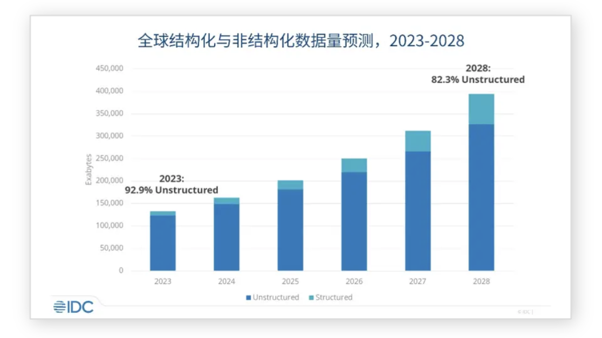
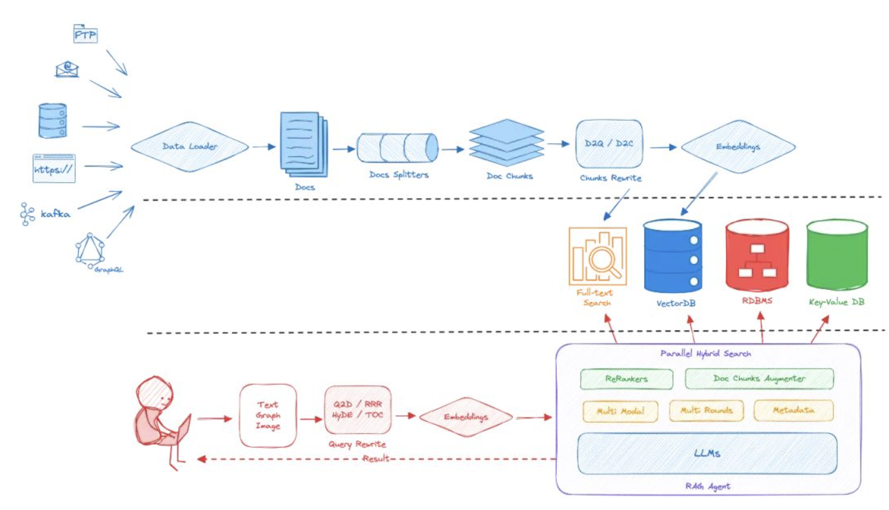
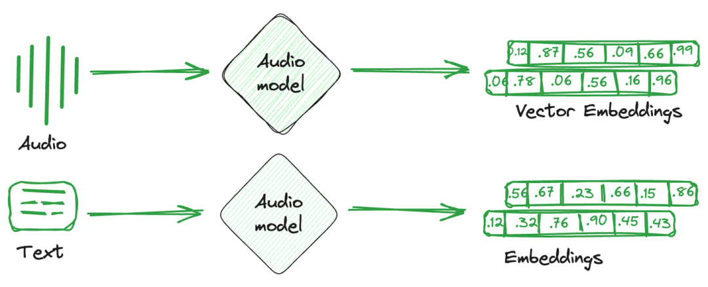

# 项目意义

在人工智能技术高速发展的今天，向量数据库已成为支撑大模型、推荐系统、图像检索等场景的核心基础设施。然而，开发者面临部署复杂、概念抽象、实战案例不足等痛点。本教程旨在通过开源、模块化、实战驱动的方式，降低向量数据库的学习门槛，推动技术普及与社区协作。其意义体现在：

1.填补知识鸿沟：系统梳理向量数据库的核心概念与部署流程，帮助开发者快速掌握这一新兴技术

2.加速AI应用落地：结合真实案例（如RAG框架、大模型知识库），解决非结构化数据处理难题

根据 IDC 的预测，到 2028 年全球互联网数据总规模将达到 393ZB，其中超 80%为非结构化数据。这一趋势表明，数据管理的范式正在转变，对非结构化数据的管理和价值发现将会成为全新的挑战。

非结构化数据的处理，正是向量数据库所擅长的。

向量数据库除了能对非结构化数据进行管理之外，也是 AI infra 中重要的基础设施。大语言模型展现了惊人的语言理解和内容生成能力，但由于模型的静态性，存在生成的内容信息更新不及时，生成内容无法溯源，有时还会存在幻觉等问题。通过 RAG 技术结合向量数据库，可以很好的解决大语言模型带来的这些问题。 解决的思路其实也很简单，在大语言模型生成最终结果之前，先将用户问题交给线上数据库检索。找出与用户问题相关的更新补充信息，或者是企业私域的专业领域的信息，以辅助大语言模型来生成更准确的结果。

因此向量数据库除了能应用在非结构化数据的管理之外，也同样可以用在大模型的增强上。

# 项目介绍

1. 什么是向量数据库？
   向量数据库是专为高维向量数据设计的数据库系统，能够将文本、图像、音频等非结构化数据转化为数学向量（即高维数组），并基于相似性度量（如余弦相似度、欧氏距离）实现高效检索。与传统关系型数据库相比，其核心优势在于：

     - 处理非结构化数据：通过嵌入模型（Embedding）将复杂数据转化为向量，突破传统数据库的行列限制。

     - 近似最近邻搜索（ANN）：利用索引技术（如HNSW、LSH）实现毫秒级海量数据检索，支持模糊匹配。

     - 多模态支持：统一管理文本、图像、视频等多源数据，构建跨模态检索能力

2. 向量数据库有什么用？
   向量数据库是AI时代的“数据枢纽”，其应用场景包括但不限于：

     - 大模型知识库增强：通过RAG（检索增强生成）框架，为ChatGPT等模型提供实时外部知识，减少“幻觉”问题。

     - 推荐系统：基于用户行为向量与商品特征的相似性匹配，实现个性化推荐（如电商、流媒体平台）。

     - 图像/音视频检索：将多媒体内容向量化，支持以图搜图、跨模态搜索（如医疗影像分析、版权检测）。

     - 物联网与边缘计算：高效处理传感器数据流，实现实时异常检测与预测性维护。
