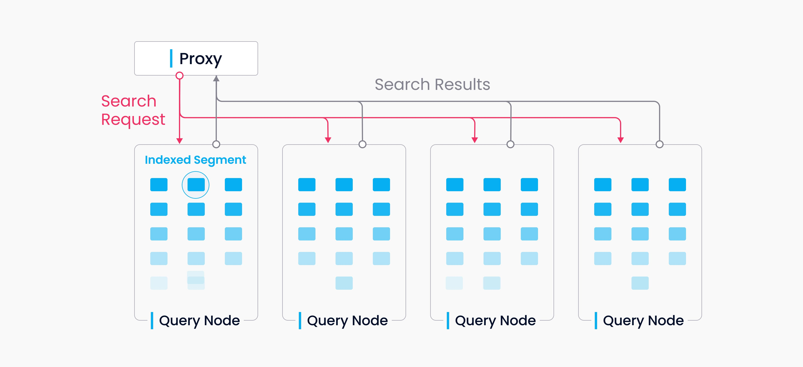
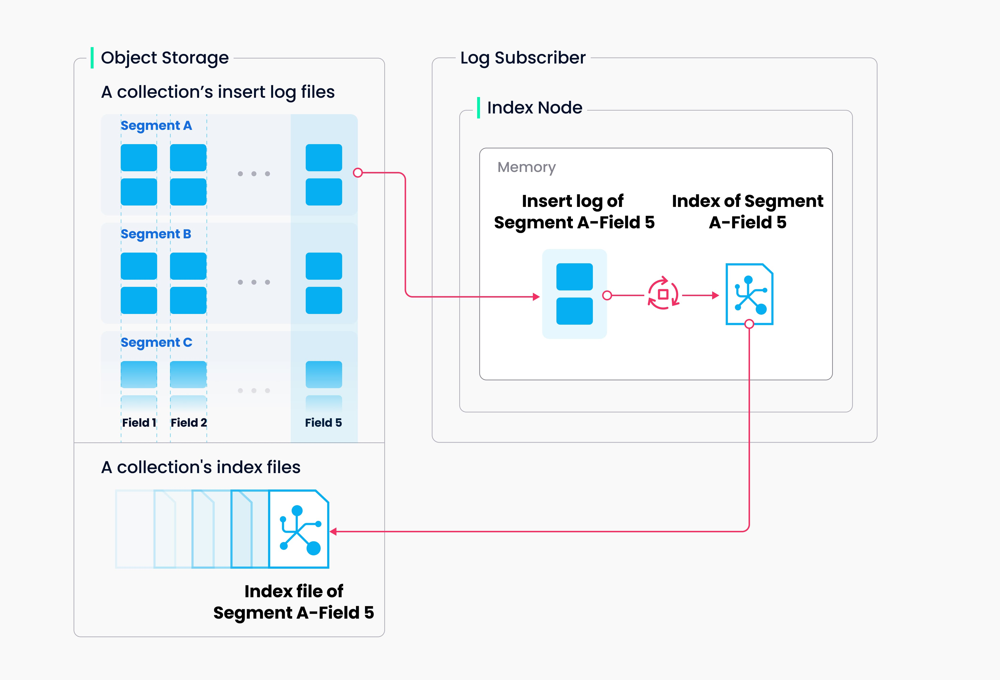
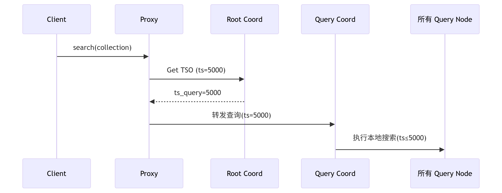

# 《Milvus 文档》

Milvus 是一款开源向量数据库，适配各种规模的 AI 应用，在本指南中，将引领你在数分钟内完成 Milvus 的本地设置，并借助 Python 客户端库实现向量的生成、存储与搜索。这里运用的 Milvus Lite，是pymilvus中包含的 Python 库，可嵌入客户端应用程序。
你需要先理解：

1. 什么是 “向量”？
你可以把 “向量” 理解成一串数字组成的 “特征密码”。生活中任何东西（比如一张图片、一句话、一个水果）都有自己的特征，向量就是把这些特征转换成数字的形式，方便后续进行相似度检索。

举个例子：

比如描述一个苹果，它的特征可能是：颜色（红色 = 1，绿色 = 0）、形状（圆形 = 1，方形 = 0）、甜度（0-10 分，假设 8 分）、大小（直径 5cm=5）。
那这个苹果的向量可能就是 [1, 1, 8, 5]—— 这串数字就代表了苹果的 “特征密码”。

在 AI 里，图片、文字都会被转换成这样的向量。比如一句话 “我爱吃苹果”，AI 会提取它的语义特征，变成一串更长的数字（比如 128 个数字），这就是 “文本向量”。

2. 什么是 “向量数据库”？
普通数据库（比如 Excel 表格）存的是文字、数字（比如 “苹果，红色，5 元”），而向量数据库专门存上面说的 “向量”（也就是 “特征密码”）。

为啥要专门存向量？因为 AI 处理数据时，不是直接比文字，而是比向量。比如想找和 “我爱吃苹果” 意思相似的句子，AI 会先把这句话转成向量，再去向量数据库里找 “数字长得最像” 的向量，对应的句子就是相似的。

Milvus 就是这样一个专门存向量的数据库，就像 “向量的仓库”。
## 快速入门
1. 设置向量数据库
要创建本地的 Milvus 向量数据库，仅需实例化一个`MilvusClient`，并指定用于存储所有数据的文件名，如`"milvus_demo.db"`。
```python
client = MilvusClient("milvus_demo.db")
```
在 Milvus 里，需要借助 `Collections` 来存储向量及其相关元数据，可将其类比为传统 SQL 数据库中的表格。创建 `Collections` 时，能定义 `Schema` 和索引参数，以此配置向量规格，包括维度、索引类型和远距离度量等。此外，还有一些复杂概念用于优化索引，提升向量搜索性能。但就目前而言，重点关注基础知识，并尽量采用默认设置。至少，需设定 Collections 的名称和向量场的维度。例如：
```python
from pymilvus import CollectionSchema, FieldSchema, DataType

fields = [
    FieldSchema(name="id", dtype=DataType.INT64, is_primary=True),
    FieldSchema(name="vector", dtype=DataType.FLOAT_VECTOR, dim=128)
]
schema = CollectionSchema(fields)
client.create_collection("my_collection", schema)
```
上述代码中，主键和向量字段采用默认名称`（"id"和"vector"）`，度量类型（向量距离定义）设为默认值（COSINE） 。
2. 插入向量
Milvus 期望数据以字典列表的形式插入，每个字典代表一条数据记录，称作一个实体。假设已有向量化后的数据vectors（为浮点数数组列表），以及对应的实体 ID 列表ids，可按如下方式插入数据：
```python
entities = [
    {"id": id, "vector": vector}
    for id, vector in zip(ids, vectors)
]
client.insert("my_collection", entities)
```
3. 向量搜索
Milvus 可同时处理一个或多个向量搜索请求。`query_vectors`变量是一个向量列表，其中每个向量都是一个浮点数数组。
```python
query_vectors = embedding_fn.encode_queries(("Who is Alan Turing?",))
```
执行搜索的示例代码如下：
```python
results = client.search(
    collection_name="my_collection",
    query_vectors=query_vectors,
    top_k=5,
    output_fields=["id"]
)
```
输出结果是一个结果列表，每个结果对应一个向量搜索查询。每个查询包含一个结果列表，其中每个结果涵盖实体主键、到查询向量的距离，以及指定output_fields的实体详细信息。
还能在过滤指定的标量（标量指非向量数据）的同时进行向量搜索，可通过指定特定条件的过滤表达式达成。例如，假设集合中存在一个名为"category"的标量字段，要搜索"category"为"tech"的相关向量，可这样操作：
```python
expr = 'category == "tech"'
results = client.search(
    collection_name="my_collection",
    query_vectors=query_vectors,
    top_k=5,
    output_fields=["id"],
    expr=expr
)
```
4. 加载现有数据
由于 Milvus Lite 的所有数据都存储于本地文件，即便程序终止，也能通过创建带有现有文件的MilvusClient，将所有数据加载至内存。例如，恢复"milvus_demo.db"文件中的集合，并继续写入数据：
```python
client = MilvusClient("milvus_demo.db")
collection = client.get_collection("my_collection")
```
## Collection
每个数据库中可包含多个Collection，类似于关系数据库中的表和记录。
Collection是一个二维表格，拥有固定的列和行，每一列表示一个字段，每一行表示一个实体，
### 构建Collection
构建一个Collection需要如下三个步骤：

1. 需要创建Schema，Schema定义了Collection的列和字段的类型。
2. 设置索引参数（可选）。
3. 创建Collection

首先，对于Schema，参考如下代码：
```python
        # 连接Milvus服务器
        connections.connect("default", host="localhost", port="19530")

        # 检查并创建collection
        collection_name = 'video_push'
        fields = [
            FieldSchema(name="id", dtype=DataType.INT64, is_primary=True, auto_id=False),
            FieldSchema(name="content", dtype=DataType.VARCHAR, max_length=1024),
            FieldSchema(name="embedding", dtype=DataType.FLOAT_VECTOR, dim=1024),
            # 你可以选择构建一些其他的字段
        ]
        schema = CollectionSchema(fields, collection_name)
        collection = Collection(name=collection_name, schema=schema)
```
其次创建索引，加载集合
```python
        collection.create_index(
            # 索引字段名
            field_name="embedding",
            # 索引参数设置
            index_params={
                "metric_type": "IP",
                "index_type": "IVF_FLAT",
                "params": {"nlist": 1024}
            }
        )
        collection.load()
```
你可以使用如下代码检查你数据库中存在的Collection:
```python
res = client.describe_collection(
    collection_name="quick_setup"
)

print(res)

```
您可以按以下方式重命名一个 Collection:
```python
client.rename_collection(
    old_name="video_push",
    new_name="Dw_easy_vectorDB"
)
```
Milvus在查询时速度很快，是因为每次加载的Collection的数据会缓存在内存中。为了减少内存的消耗，您可以使用动态字段的方式加载你需要的数据进入Milvus。
```python
client.load_collection(
    collection_name="Dw_easy_vectorDB",
    load_fields=["id", "embedding"]
    skip_load_dynamic_field=True 
)
```
这样做除了能减少内存的消耗外，还有一个好处，即后续使用GPU HMB和SSD对大规模数据进行优化存储和加速检索时，id字段所占用的空间非常小，往往只有几bit，在CPU和SSD、HMB之间传输时，性能差异不大，因此可以忽略消耗。
关于这一部分，请学习完成所有知识后，浏览[FusionANNS]()。

当你使用结束此Collection后，请及时释放Collection，释放内存。
```python
client.release_collection(
    collection_name="Dw_easy_vectorDB"
)

res = client.get_load_state(
    collection_name="Dw_easy_vectorDB"
)

print(res)
```
如果你的使用场景是大模型问答系统，对于用户提供的信息数据，你需要快速的向量化存储，以便提供更加高质量的回答，并且你使用的模型上下文比较短的情况下，可以通过设置Collection的TTL来实现。用户投喂的大规模文档数据，存储到Milvus中，并设置TTL，Milvus会自动删除过期的数据。
你可以使用如下代码来实现：
```python
#  创建新的集合
from pymilvus import MilvusClient

client.create_collection(
    collection_name="Dw_easy_vectorDB",
    schema=schema,
    properties={
        "collection.ttl.seconds": 604800 # 7天
    }
)

```
```python
#  修改已存在的集合
client.alter_collection_properties(
    collection_name="Dw_easy_vectorDB",
    properties={"collection.ttl.seconds": 604800}
)
```

### Collection中设置数据分区
当你第一次创建一个Collection时，所有的数据都会被存储在一个默认分区中。然而，为了更好地管理数据，你可以创建多个分区，并将数据分布到这些分区中。分区可以让你更有效地管理和查询数据，例如，你可以根据时间戳将数据分布到不同的分区中，以便按时间范围查询数据。

创建分区：
```python
client.create_partition(
    collection_name="Dw_easy_vectorDB",
    partition_name="partition_1"
)
```
删除分区：
```python
client.drop_partition(
    collection_name="Dw_easy_vectorDB",
    partition_name="partition_1"
)
```
查询分区：
```python
client.list_partitions(
    collection_name="Dw_easy_vectorDB"
)
```
向分区中插入数据：
```python
client.insert(
    collection_name="Dw_easy_vectorDB",
    partition_name="partition_1",
    entities=entities
)
```
查询分区中的数据：
```python
client.query(
    collection_name="Dw_easy_vectorDB",
    expr="partition_name == 'partition_1'",
)
```
不过，对于某些问答系统，分区的设计会影响查询性能。我们很难确定对于某一个问题的答案，应该从哪个分区中查询，除此之外，我们不能保证另一个不相干的分区中是否包含了某条可能对最终回答产生重要影响的数据。所以，不建议使用分区。

### Shema
待完善
### 索引
参考[Milvus 索引介绍](./milvus%20索引介绍.md)
## 基本向量搜索
核心概念：ANN 搜索和 kNN 搜索
这俩是向量搜索的两种方式，先搞懂它们的区别。
1. 什么是 “kNN 搜索”？
全称是 “k 近邻搜索”。简单说就是：拿你的查询向量，和数据库里所有向量一个个比，找出最像的前 k 个（k 是你指定的数量，比如前 5 个）。

举个例子：
你有 1000 张动物图片，每张都转成了向量。现在你拿一张 “猫” 的图片向量去搜，kNN 会把这张向量和 1000 张的向量全比一遍，最后挑出最像的 5 张（大概率也是猫）。

缺点：如果数据库里有 10 亿个向量，一个个比就太慢了，像在 10 亿本书里找一本相似的，从头翻到尾，耗时又耗力。

2. 什么是 “ANN 搜索”？
全称是 “近似近邻搜索”。它不跟所有向量比，而是用 “偷懒” 的办法：提前给向量做 “分类整理”（也就是建 “索引”），然后只在 “可能相似的小范围” 里找，最后返回差不多像的前 k 个。

还是刚才的例子：
提前把 1000 张动物图片分好类（比如 “猫科”“犬科”“鸟类”），建一个 “索引”（类似分类标签）。搜 “猫” 的向量时，ANN 会先通过索引定位到 “猫科” 分类，只在这个小分类里比，不用看犬科和鸟类，速度就快多了。

特点：虽然可能不是 100% 最像的（但差距很小），但速度快太多，适合大数据量的场景（比如手机上的图片搜索、聊天机器人回答问题）。

1. ANN 搜索基础
与 kNN 的区别：kNN 需比较所有向量，耗时耗资源；ANN 依赖预建索引文件，快速定位相似向量子组，平衡性能与正确性。
AUTOINDEX：自动分析集合数据分布，优化索引参数，降低使用门槛，适配多种度量类型。
度量类型：不同度量方式对应不同相似度判断标准，如L2（值越小越相似）、IP（值越大越相似）等，距离范围各有不同。
1. 主要搜索操作
* 单向量搜索：针对单个查询向量，根据索引和度量类型返回前 K 个最相似向量。
* 批量向量搜索：同时处理多个查询向量，Milvus 并行执行搜索并返回对应结果集，代码结构与单向量类似，仅需传入向量列表。
* 分区中的 ANN 搜索：通过指定partition_names参数将搜索范围限制在特定分区，减少数据量以提升性能，适用于集合内有多个分区的场景。
* 使用输出字段：默认返回主键和距离，可通过output_fields指定额外字段（如color），使结果包含更多实体信息。
* 限制与偏移：limit控制单次返回结果数（top-K），offset用于分页查询（跳过指定数量结果），两者总和需小于 16384。


了解完这些基本的概念后，我们可以开始编写代码来使用 Milvus 进行搜索。
### 单向量搜索
单向量搜索指的是只涉及一个查询向量的搜索。根据预建索引和搜索请求中携带的度量类型
>  “度量类型” 是什么？
    简单说，是 “判断两个向量有多像的尺子”。不同的场景用不同的尺子，结果也不一样。

    举几个常见的：
    * L2（欧氏距离）：像量两个点之间的直线距离。比如比较两个水果的向量（颜色、大小、甜度），L2 值越小，说明两个水果越像。
    * COSINE（余弦相似度）：像看两个向量的 “方向” 有多一致。比如两句话 “我爱吃苹果” 和 “苹果是我最爱”，它们的向量方向很像，余弦值接近 1，说明意思相似（忽略句子长度，只看语义方向）。
    * IP（内积）：可以理解成 “特征重叠度”。比如两个用户的兴趣向量（喜欢的电影、音乐），IP 值越大，说明兴趣越重合，适合推荐系统。

本节将介绍如何进行单向量搜索。搜索请求携带单个查询向量，要求 Milvus 使用内积（IP）计算查询向量与 Collections 中向量的相似度，并返回三个最相似的向量。
```python
from pymilvus import MilvusClient

client = MilvusClient(
    uri="http://localhost:19530")

query_vector = [...................]
res = client.search(
    collection_name="Dw_easy_vectorDB",
    anns_field="embedding",
    data=[query_vector],
    limit=3,
    search_params={"metric_type": "IP"}# 注意，这里的metric_type 必须与创建索引时设置的一致
)

for hits in res:
    for hit in hits:
        print(hit)

# [
#     [
#         {
#             "id": 551,
#             "distance": 0.08821295201778412,
#             "entity": {}
#         },
#         {
#             "id": 296,
#             "distance": 0.0800950899720192,
#             "entity": {}
#         },
#         {
#             "id": 43,
#             "distance": 0.07794742286205292,
#             "entity": {}
#         }
#     ]
# ]
```
Milvus 根据搜索结果与查询向量的相似度得分从高到低排列搜索结果。相似度得分也称为与查询向量的距离，其值范围随使用的度量类型而变化。

### 批量向量搜索

批量向量搜索
同样，您也可以在一个搜索请求中包含多个查询向量。Milvus 将并行对查询向量进行 ANN 搜索，并返回两组结果。
```python
query_vectors = [
    [.....],
    [.....],
    [.....],
    [.....]
]

res = client.search(
    collection_name="Dw_easy_vectorDB",
    data=query_vectors,
    limit=3,
)

for hits in res:
    print("TopK results:")
    for hit in hits:
        print(hit)

```

### 分区中的 ANN 搜索
假设您在 Collections 中创建了多个分区，您可以将搜索范围缩小到特定数量的分区。在这种情况下，您可以在搜索请求中包含目标分区名称，将搜索范围限制在指定的分区内。减少搜索所涉及的分区数量可以提高搜索性能。

下面的代码片段假定在你的 Collections 中有一个名为PartitionA的分区。
```python
query_vector = [.........]
res = client.search(
    collection_name="Dw_easy_vectorDB",
    partition_names=["partitionA"],
    data=[query_vector],
    limit=3,
)

for hits in res:
    print("TopK results:")
    for hit in hits:
        print(hit)
```
### 使用输出字段

在搜索结果中，Milvus 默认包含包含 top-K 向量嵌入的实体的主字段值和相似性距离/分数。您可以在搜索请求中包含目标字段（包括向量和标量字段）的名称作为输出字段，以使搜索结果携带这些实体中其他字段的值。
```python
# 4. Single vector search
query_vector = [0.3580376395471989, -0.6023495712049978, 0.18414012509913835, -0.26286205330961354, 0.9029438446296592],

res = client.search(
    collection_name="Dw_easy_vectorDB",
    data=[query_vector],
    limit=3, # The number of results to return
    search_params={"metric_type": "IP"}，
    output_fields=["color"]
)

print(res)
```

### 使用限制和偏移
您可能会注意到，搜索请求中携带的参数limit 决定了搜索结果中包含的实体数量。该参数指定了单次搜索中返回实体的最大数量，通常称为top-K。
比如搜出来 100 个相似结果，一页显示 20 个，就可以用 “limit=20”（每页 20 个）和 “offset=20”（跳过前 20 个，看第 2 页）。但注意：一次最多看 16384 个结果，太多了会变慢。
```python
query_vector = [.............],

res = client.search(
    collection_name="Dw_easy_vectorDB",
    data=[query_vector],
    limit=3, 
    search_params={
        "metric_type": "IP", 
        "offset": 10 
    }
)
```

> 后续内容待补充......


## 深入 Milvus 架构设计：数据写入和查询高层级流程

掌握 Milvus 仅了解基础使用是不够的，深入理解其**云原生分布式架构设计原理**至关重要。这将助你优化性能、高效排查问题，并在生产环境中做出明智的配置决策。

### Milvus 核心架构概览

Milvus 采用存储计算分离的分布式架构，


核心组件如下：

1.  **接入层（Access Layer）**：处理客户端请求（SDK, REST API）。
2.  **协调服务（Coordinator Services）**：集群的“大脑”，管理元数据和任务调度。
3.  **工作节点（Worker Nodes）**：执行具体任务的“肌肉”（查询、写入、索引）。
4.  **存储层（Storage）**：持久化数据和元数据的“基石”。

| 组件               | 存储内容                                   | 后端技术                          |
| :----------------- | :----------------------------------------- | :-------------------------------- |
| **Log Broker**     | 数据变更日志（Insert/Delete/Update）       | Pulsar/Kafka/RocksDB              |
| **Object Storage** | 向量原始数据、索引文件、Segment 文件       | MinIO/S3/Azure Blob/GCS/本地文件  |
| **Metadata Storage** | 集合Schema、Segment状态、节点信息、TSO     | ETCD/MySQL/TiDB                   |
| **Query Node**     | *热数据缓存*、内存索引、执行引擎           | 本地SSD/Memory/GPU                |
| **Data Node**      | 写入缓冲区（WAL）                          | 本地磁盘                          |

### 核心设计理念

1.  **存储计算分离**：计算节点无状态，状态（元数据、数据、索引）存于外部服务。实现**弹性扩缩容**、**高可用**（节点故障快速替换）、**成本优化**（计算按需，存储经济）。
2.  **读写分离**：Query Node (读)、Data Node (写)、Index Node (索引构建) 职责清晰，互不干扰。
3.  **日志即数据**：数据写入首先进入 Log Broker，作为数据的“唯一真实来源”。Data Node 消费日志写存储，Query Node 消费日志保持数据最新视图，确保**数据一致性**和**流批一体**。
4.  **微服务化**：组件独立部署、通信（gRPC），易于维护、升级、扩展。
5.  **向量优化**：架构围绕高效处理大规模高维向量 ANN 搜索设计。

### 核心组件详解

#### 1. 接入层 (Access Layer)
*   **SDKs / RESTful Gateway**：用户交互入口（如 `pymilvus.insert()` / `.search()`）。
*   **负载均衡器** (LB)：分发请求到后端 Coordinator（通常由 K8s Service 或 Nginx 实现）。
*   **设计要点**：易用性、协议兼容性、连接管理。

#### 2. 协调服务 (Coordinator Service - 大脑)
由多个角色组成（可同进程或不同进程部署）：
*   **Root Coordinator (Root Coord)**：
    *   管理 DDL（创建/删除集合/分区/索引）。
    *   分配全局唯一递增的时间戳 (TSO - Timestamp Oracle)，保证操作顺序和快照隔离一致性。
    *   收集展示集群指标。*唯一有状态角色*（状态存于 Metadata Storage）。
*   **Query Coordinator (Query Coord)**：
    *   接收查询请求，解析查询计划。
    *   将查询任务分发给 Query Node，合并结果。
    *   管理 Query Node 负载均衡和故障转移。
*   **Data Coordinator (Data Coord)**：
    *   管理数据生命周期（Segment）、刷新 (Flush)、压缩 (Compaction)。
    *   分配数据写入任务给 Data Node。
    *   协调 Data Node 与 Index Node。
    *   管理 Data Node 负载均衡和故障转移。
*   **Index Coordinator (Index Coord)**：
    *   接收索引创建请求。
    *   分配索引构建任务给 Index Node，监控状态。
    *   管理 Index Node 负载均衡和故障转移。
*   **设计要点**：高可用（依赖 etcd/ZK 选主）、高效调度、元数据缓存（减少后端访问压力）。

#### 3. 工作节点 (Worker Nodes - 肌肉)
无状态，可水平扩展。
*   **Query Node (查询)**：

    

    *   **核心职责**：执行向量/标量数据的搜索 (Search) 和查询 (Query)。
    *   **关键机制**：
        *   **订阅日志**：从 Log Broker 订阅负责 Segment 的增量数据，保持内存视图最新。
        *   **加载 Segment**：按 Query Coord 调度，从 Object Storage 加载 Segment 数据（向量、标量、**索引文件**）到内存或本地 SSD 缓存（*冷数据加载*）。
        *   **执行引擎**：包含核心**算子**：
            *   **向量距离计算算子** (SIMD/多线程/GPU 优化)：L2, IP, Cosine 等。
            *   **ANN 搜索算子** (基于索引如 IVF_FLAT/HNSW)：在内存索引上执行近似搜索。
            *   **标量过滤算子**：执行属性过滤 (`price>100`, `color='red'`)，涉及布尔运算、比较等。
            *   **结果合并与排序算子**：对局部结果进行合并、全局 TopK 排序（堆排序/归并排序）。
        *   **资源管理**：控制内存、CPU 并发。
*   **Data Node (写入)**：
    *   **核心职责**：处理数据插入、删除、更新（通过 Delete+Compaction），持久化数据。
    *   **关键机制**：
        *   **消费日志**：从 Log Broker 消费 Insert/Delete 消息。
        *   **写 Buffer & Flush**：内存缓冲数据，达到阈值（时间/大小）后以 **Segment 文件**形式 Flush 到 Object Storage。
        *   **Compaction 算子**：后台合并小 Segment、清理删除数据，优化查询性能。
*   **Index Node (索引构建)**：
    *   **核心职责**：为 Data Node Flush 生成的 Segment 文件构建索引。
    *   **关键机制**：
        *   **加载 Segment 数据**：从 Object Storage 加载数据。
        *   **索引构建算子**：调用底层库（Faiss/HNSWlib）执行构建（如 IVF 聚类 / HNSW 图构建），完成后将**索引文件**存回 Object Storage。*计算密集型*。

#### 4. 存储层 (Storage Layer - 基石)


*   **元数据存储 (Metadata Storage)**：存储所有系统元数据（Schema, 分区, Segment 元信息, TSO 状态等）。*强一致、高可用* (etcd/MySQL/TiDB)。Root Coord 主要使用者。
*   **日志存储 (Log Broker)**：数据变更操作（Insert/Delete/DDL）的载体。*高吞吐、低延迟、持久化、顺序保证* (Pulsar/Kafka)。Data Node 的写入来源，Query Node 的数据更新来源。
*   **对象存储 (Object Storage)**：持久化 Segment 原始数据文件、**索引文件**、Compaction 中间文件。*高可靠、高持久、高扩展、低成本* (MinIO/S3/Azure Blob/GCS)。访问延迟相对较高。

---

### Milvus 数据写入高层级流程 (结合图片步骤)


1.  **用户请求**：客户端通过 SDK (如 `pymilvus.insert()`) 发起插入请求。
2.  **接入代理**：请求到达 Proxy 网关。
3.  **验证与转发**：
    *   Proxy 验证请求合法性（集合存在、数据格式合规）。
    *   负载均衡转发给 Root Coordinator。
4.  **分配顺序**：
    *   **Root Coord** 为操作分配全局唯一时间戳 (TSO)，确保分布式顺序一致性。
    *   通知 **Data Coord**。
5.  **元数据管理与分配 (Data Coord)**：
    *   查询 **Metadata Storage (etcd)** 获取目标集合存储策略。
    *   决定数据存储位置（创建新 Segment 或使用现有写入 Segment）。
    *   记录 Segment ID、状态、分配信息到 **Metadata Storage**。
6.  **日志先行 (Log Broker)**：**所有数据变更必须首先写入 Log Broker** (如 Pulsar/Kafka)，保证操作的持久性和严格顺序性。这是“日志即数据”理念的核心体现。
7.  & **8. 数据节点消费与持久化 (Data Node)**：
    *   **Data Node** 订阅并消费 **Log Broker** 中的 Insert/Delete 消息。
    *   数据先写入**内存缓冲区** (*此时即可被 Query Node 订阅消费用于实时查询*)。
    *   当缓冲区达到阈值（时间或大小）时，触发 **Flush** 操作：
        *   将缓冲数据（向量、标量）作为 **Segment 文件**写入 **Object Storage (MinIO/S3)**。
        *   Flush 创建新的 Segment。
9.  **触发索引构建 (Index Coord)**：
    *   **Data Coord** 通知 **Index Coord** 有新 Segment 产生。
    *   **Index Coord** 调度 **Index Node** 为新 Segment 构建索引。
10. **异步索引构建 (Index Node)**：

    

    *   **Index Node** 从 **Object Storage** 读取新 Segment 的原始数据。
    *   执行**索引构建算子**（如 IVF 聚类、HNSW 图构建）。
    *   将生成的**索引文件**写回 **Object Storage**。此过程是**异步**的，避免阻塞写入。

### Milvus 查询高层级流程 (结合图片步骤)


1.  **用户请求**：客户端通过 SDK (如 `pymilvus.search()`) 发起搜索请求。
2.  **接入代理**：请求到达 Proxy 网关。
3.  **协调与分发 (Query Coord)**：
    *   Proxy 转发请求给 **Query Coord**。
    *   **Query Coord** 从 **Root Coord** 获取时间戳 (TSO)，保证读取一致性（快照隔离）。
    *   解析查询请求和过滤条件。
    *   根据 **Metadata Storage** 信息，确定哪些 **Segment** 包含目标数据。
    *   将搜索子任务分发给持有这些 Segment 的 **Query Node** 实例（支持并行）。
4.  **查询节点执行准备 (Query Node)**：
    *   **Query Node** 接收任务。
    *   **检查缓存**：所需 Segment 数据（向量、标量、索引）是否已在**内存**或**本地 SSD 缓存**中（热数据）。
    *   **冷数据加载**：若不在缓存中，则从 **Object Storage** 拉取对应的 **Segment 原始数据文件**和**索引文件**到内存/缓存。
        *   **索引文件是什么？** 是为加速搜索预先构建的数据结构文件（非原始数据）。例如：
            *   *IVF 索引*：存储聚类中心向量和各中心的向量 ID 列表。搜索时先找近邻中心，再在对应列表内精搜。
            *   *HNSW 索引*：存储向量间的多层图连接关系。搜索时在图上游走快速逼近目标。
            *   *FLAT*：无额外文件，直接暴力比较（最准但最慢）。
        *   **为什么单独存储？** 分离存储节省内存、利用预计算优化、支持多种索引。
5.  **本地搜索执行 (Query Node - 核心算子)**：
    *   **标量过滤算子**：首先应用属性过滤条件 (如 `price>100`) 进行剪枝，得到候选向量 ID 集。
    *   **ANN 搜索算子**：在加载的**索引文件**结构上执行近似最近邻搜索（利用索引加速）。
    *   **向量距离计算算子**：对 ANN 返回的候选向量，精确计算与查询向量的距离 (L2/IP/Cosine)。*高度优化点 (SIMD/多线程/GPU)*。
    *   **局部 TopK 算子**：基于精确距离，计算并保留当前 Query Node 负责的 Segment 数据中的局部 TopK 结果 (ID + 距离)。
6.  **结果合并与返回 (Query Coord)**：
    *   **Query Coord** 收集所有 **Query Node** 返回的**局部 TopK** 结果。
    *   **全局 TopK 合并算子**：使用**最小堆**等算法合并所有局部结果，得到最终的全局 TopK。
    *   **数据组装**：若查询需要返回实体数据（非仅 ID 和距离），则从 **Object Storage** 或 **Query Node 缓存**中获取对应 ID 的完整字段。
7.  **结果返回**：最终结果通过 Proxy 返回给客户端 SDK。

---

### 关键架构优势与机制总结

*   **读写分离**：Data Node 专注写入吞吐，Query Node 专注查询延迟，通过 Object Storage 解耦。
*   **流批一体**：Log Broker 处理实时流，Object Storage 存储批数据，Query Node 通过订阅日志实现流批统一视图。
*   **索引异步构建**：写入路径只处理原始数据持久化，索引构建由 Index Node 异步完成，避免阻塞写入。
*   **段（Segment）管理**：Data Node 的 **Compaction 算子** 自动合并小 Segment 为大 Segment，优化查询效率（减少打开文件数，提升索引效率）。
*   **一致性模型**：基于 **Root Coord** 分配的 **TSO (Timestamp Oracle)** 实现 **快照隔离 (Snapshot Isolation)**。查询看到的是其开始时刻确定的快照视图，写入按全局顺序提交。
*   **性能关注点**：遇到性能瓶颈时，需重点考察：
    *   **Log Broker 吞吐**：是否成为写入瓶颈？
    *   **Object Storage 延迟**：冷数据加载和索引构建是否过慢？
    *   **Query Node 资源**：内存是否足够缓存热数据和索引？CPU/GPU 是否达到瓶颈？索引加载状态是否健康？
    *   **网络带宽**：Data/Index/Query Node 与 Object Storage 间数据传输是否受限？

---

### 回顾与总结

回过头来，回顾一下各个组件的作用

各个组件分为三个部分，协调器（Coordinator）、Node、Storage组件。

协调器组件中包含Root Coordinator，用于分配全局唯一的TSO，并管理集合、分区的元数据；Data Coordinator，管理Segment，创建和状态切换，然后触发flush刷入数据，并且通知索引协调器构建索引；Query Coordinator查询协调器，负责负载均衡查询节点，管理segment的分布，即分布到不同的node上，合并全局Topk结果，这个topk是从各个query node中获取的局部topk的总和；Index Coordinator索引协调器，被data coordinator协调器调用，segment被构建后，会进行索引的构建任务，并且索引协调器会监控索引的构建状态。

Node组件中包含Data Node，被根协调器调用，用于消费Log Broker数据，管理内存缓冲区（缓存，用户之后查询节点query node的查询），Flush segment到Object Storage对象存储中；Query Node查询节点，被查询协调器所调用，当然，这些节点不止有一个，包括数据的node也是，可以采用并行的策略一起处理，Query Node首先加载Segment和Index file并执行本地搜索，这个搜索就是先过滤，分片数据，然后使用索引加速搜索，最后进行精确的L2或者IP的距离计算，获取topK作为该node的局部topk返回给协调器。Index Node索引节点用于构建索引文件，上传索引到对象存储，被数据协调器所调用，segment变化时，通知Index Node构建索引。

Storage组件中包含Log Broker，用于持久化数据变更日志，数据协调器中，新的数据一定是先存日志！Object Storage组件用于存储Segment的原始文件数据和Index file，这个部分会被查询流程中Query Node查询节点调用，然后在数据的存储流程中被Data Node调用，触发Index Coordinator进行索引构建Index Node，然后segment会被存入到Object Storage中；Metadata Storage组件，存储集合Schema、Segment分配信息、索引元数据，该组件首先在proxy部分就会被调用一次，因为要根据schema验证用户请求是否合法，然后在查询流程中根据 **Metadata Storage** 信息，确定哪些 **Segment** 包含目标数据

以上部分即为各个组件的作用以及相互之间的调用关系总结。至于流程，看我画的图吧。

### 补充 解惑

你可以注意到一个问题，查询协调器和数据协调器是两个不同的组件，虽然都被根协调器所管理，但地下的各个查询、存储节点都是独立的，当数据节点还在运行，查询节点也同样的在运行，那么如何保证Query Node查询的数据是最新的呢？

这就要得益于**Log Broker的日志订阅机制+TSO+增量数据管理**，

在此之前，所有的插入和删除操作都是先写入Log Broker中，每条操作分配一个全局递增的TSO。
1. **日志订阅机制**：当每个Query Node启动时，会向Data Coordinator数据协调器注册并订阅所负责的segment的Delta Channel日志通道(比如delta-collection-01)，这个channel是Log Broker（比如Kafka）中存储**增量变更**的特殊Topic。
    ```go
    func stratQueryNode(){
        channels := DataCoord.GetDmlChannels(colletcionId)//获取订阅topic
        for _,ch := range channels{
            //Query Node会持续的从Log Broker拉取日志（gRPC）。并且写入内存缓冲区（还没有被Flush到Object Storage）
            go SubscirbeToDeltaChannel(ch)
        }
    }
    ```
    在这个订阅下，消费的内容格式将为：
    ```json
    {
        op_type: Insert,
        data:[vector1,id:100],
        tso:4500
    }
    {
        op_type: Delete, 
        ids: [200,201],
        tso: 4502
    }
    ```
2. **TSO全局一致性**：当用户通过SDK发起请求后，进入Proxy网关代理，Proxy从Root Cooordinator中获取一个全局TSO，假如这次请求是用户查询请求，那可以设置ts_query = 5000，这个5000就作为整个流程下的时钟。


3. **增量数据管理**：首先你需要知道这些增量数据从哪里来，一是从Object Storage中存储的Segment文件（就是数据协调器创建的），二是由Query Node内存中增量生成的。我们消费这些数据是根据分配的TSO来消费的，对于来源一的数据，他的数据的范围即数据中tso <= Flush时间点，即这个数据的创建时间要比他入库Object Storage中的时间要小。对于来源二的数据，他的数据范围是 Flush时间点 < tso <= 当前tso
```python 
def execute_local_search(segment, ts_query):
    # 1. 加载持久化数据（历史快照）
    base_data = load_segment_from_storage(segment)  # ts ≤ flush_ts
    
    # 2. 应用增量变更
    delta_ops = delta_buffer.get_ops_range(flush_ts+1, ts_query)
    for op in delta_ops:
        if op.is_insert:
            base_data.insert(op.data)
        elif op.is_delete:
            base_data.delete(op.ids)
    
    # 3. 在合并后数据上执行搜索
    return search_on_dataset(base_data)
```

### 关键问题/挑战

1. 看到这里，细心的小伙伴可以注意到，我们的数据都是存储到日志里面的，那我们查询的时候，**万一查到过期的增量数据了怎么办**，毕竟这些数据都在Log Broker里面，我们又没有执行删除。对于这个问题，Milvus的Delta Channel有一种叫做**Checkpoit机制**，该机制下，Data Coordinator会标记每一个Segment的seal time停止写入时间，当我们有一个Query Node订阅了该topic的时候，Query Node只需要消费`tso > checkpoint_ts`的日志即可，避免了全量重放。

2. 上文go代码里面注释里面写道：我们Query Node会持续的从Log Broker拉取日志，并且写入内存缓冲区，注意此处还没有Flush到Object Storage中。那此时我们就有了一个问题：**Flush到Object Storage的时候如何保证数据一致性呢？**对于这个问题，Milvus采用两段式切换策略，在该策略下，Data Node完成Flush后先通知Data Coordinator数据协调器，由数据协调器更新元数据
    ```json
    // etcd 元数据变更
    {
        "segment_id": 1001,
        "state": "Flushed",
        "flush_ts": 4500 // 新时间戳分水岭
    }
    ```
    下面的Query Coordinator收到数据变更的通知后：要求Query Node停止使用旧的增量，比如这里的flush_ts=4500，那表示ts<=4500的数据以及被持久化存储到Object Storage中了，然后就可以加载新的Segment文件了。

    

    上图中，根协调器异步的将请求发送到查询协调器和数据协调器，或者说，这种发布-订阅的模式，使得查询节点和数据节点无需直接通信即可获取相同的数据变更，并且根据tso判断待处理的segment，这就保证了数据的实时性获取。但数据协调器和查询协调器又不是完全的互不关联的，两者通过etcd共享segment的状态（回过头想一想，那一步用到了segment状态？）确保存储层和查询层对数据可见性达成共识。