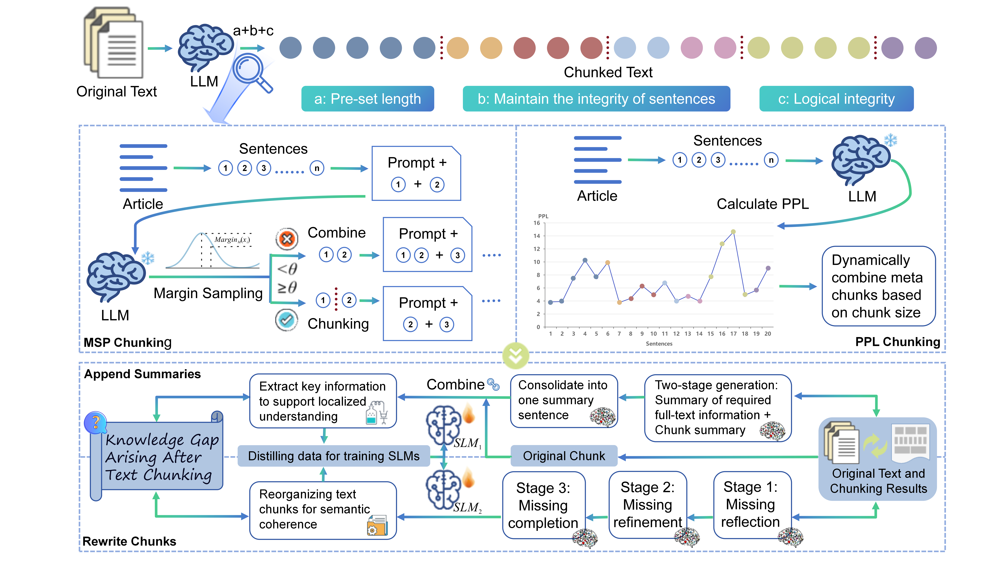
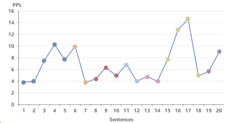
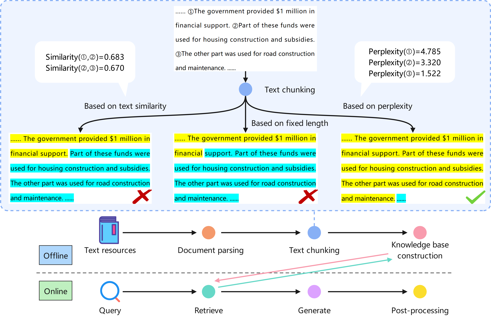

# Meta-Chunking

该章节大部分内容将围绕着论文中提到的新技术和架构设计展开，FusionANNS部分有一个Demo代码，但并没有调用GPU，也没有充分的利用SSD进行存储。主要原因是架构设计过于庞大难以实现，属于整体项目架构方面，但本文中介绍的Meta-Chunking框架，在RAG系统中是极为重要的，数据分块的质量将直接影响到问答系统的召回率。低效的分块策略会导致上下文不完整或包含过多无关信息，从而损害问答系统的性能。

但在RAG的流程中，文本分块往往是容易被忽视的关键环节，这篇论文中提出Meta-Chunking这一元分块框架，**通过识别最优分割点与保留全局信息的双重策略，专门提升分块质量**。





如图 1 所示，Meta-Chunking融合了传统文本分块策略的优势，例如遵循预设的分块长度约束和确保句子结构完整性，同时增强了在分块过程中保证逻辑连贯性的能力。我们将通过分块获得的每个文本块称为元块（Meta-Chunk），它由段落中按顺序排列的句子集合组成。这些句子不仅具有语义相关性，更重要的是还包含深层次的语言逻辑联系，包括但不限于总分、并列、递进和例证等关系。
该方法基于一个核心理念：通过允许分块大小的可变性，更有效地捕捉并保持内容的逻辑完整性。这种动态调整的粒度控制确保每个分割后的块都包含完整且独立的思想表达，从而避免分割过程中出现逻辑链条断裂。这不仅提升了文档检索的相关性，同时也增强了内容的清晰度。

首先突破基于相似度的分块局限，我们利用LLM的能力，设计了两种基于不确定性的自适应分块技术**Perplexity Chunking（PPL）** and **Margin Sampling Chunking（MSP)** 针对不同文本的固有复杂性，我们通过动态合并实现元分块，在细粒度与粗粒度文本分块间取得平衡。此外，我们建立了全局信息补偿机制，包含两阶段层次化摘要生成流程与聚焦缺失反思、精修和补全的三阶段文本块重写过程。这些组件共同增强了文本块的语义完整性与上下文连贯性。

对于一些论文中提到的专业术语，我们进行了翻译和解释：
- Through lightweight chunking algorithm design, the logical analysis capability of LLMs is decoupled into computable the PPL features and MSP indicators, achieving identification of textual logical boundaries and dynamic balance of chunking granularity.

  • 通过轻量级分块算法设计，将 LLMs 的逻辑分析能力解耦为可计算的 PPL 特征和 MSP 指标，实现文本逻辑边界的识别与分块粒度的动态平衡。

- We establish a information compensation mechanism that collaboratively executes through a three-stage missing-aware rewriting process and a two-stage context-aware summary generation, repairing the semantic discontinuities in text chunks.

  • 我们建立了信息补偿机制，通过三阶段缺失感知重写流程与两阶段上下文感知摘要生成的协同执行，修复文本块中的语义断裂问题。

下面将正式进入论文的详细介绍部分，首先你需要了解文章中提出的两个非常重要的概念，同时也是论文提出的分块的两种策略：
> 1. **PPL (Perplexity)**：困惑度是自然语言处理中一个常用的评价指标，用于衡量一个概率模型预测样本的能力。简单来说，它评估了语言模型在预测下一个词时的不确定性。较低的困惑度意味着模型对文本的理解更好，能够更准确地预测下一个词。因此，在轻量级分块算法设计中，PPL 特征可能被用来作为衡量文本逻辑连贯性的一个标准，以帮助识别文本的逻辑边界。
> 2. **MSP (Most Significant Passage)**：虽然“MSP”这个缩写在特定领域可能有多种含义，但在这里，我们可以假设它指的是“最重要段落”或“最具代表性片段”。在给定的语境下，MSP 指标可能是用于识别文本中最能代表其主要内容或主题的部分。通过计算每个分块的重要性或代表性，可以帮助实现分块粒度的动态平衡，确保每个分块既不过于细碎也不过于笼统，从而更好地保持原始文本的逻辑结构和信息完整性。

### 策略一 Perplexity Calculation per Sentence （PPL困惑度）
一句话来说：给定一个上下文T，对于T的下一个的词ti，PPL表示LLM在T的基础上，对ti的预测难度。
**核心目标：** 将长文本分割成多个**连贯**的语块 (`X1, X2, ..., Xk`)，每个语块由连续的句子组成 (`xi`)，并且最终语块的长度尽可能满足用户需求。
$$
\text{PPL}_M(x_i) = \sum_{k=1}^{K} \frac{\text{PPL}_M(t_k^i \,|\, t_{<k}^i, t_{<i})}{K}
$$
我们先来看懂这个公式：
*   **目标：** 量化当前句子 $xi$ 在给定其**之前所有文本内容** ($x1, x2, ..., xi-1$) 的上下文下，语言模型 (LLM $M$) 对其的“惊讶程度”或“预测难度”。
*   **PPL:** 困惑度 (Perplexity, PPL) 是衡量语言模型预测能力的一个指标。**PPL 越低，表示模型对当前词序列的出现越不感到“困惑”，即该序列在给定上下文中越“自然”、越“可预测”、越“连贯”。**
*   **公式 (1) 详解：**
    $$PPL_M(xi) = ( Σ_{k=1}^{K} PPL_M(t_k^i | t_{<k}^i, t_{<i}) ) / K$$

    *   $xi$: 当前要计算 PPL 的第 $i$ 个句子。
    *   $K$: 句子 $xi$ 中包含的 **token (词元)** 的总数量。例如，$xi$ = “我喜欢苹果” 可能被分词成 `["我", "喜欢", "苹果"]`，那么 $K=3$。
    *   $t_k^i$: 句子 $xi$ 中的第 `k` 个 token。
    *   $t_{<k}^i$: 句子 $xi$ 中，排在 $t_k^i$ **之前**的所有 token。即 $xi$ 句子内部，`t_k^i` 的上文。
    *   $t_{<i}$: 所有排在句子 $xi$ **之前**的 token。即整个文档中，$xi$ 之前的所有句子的所有 token。这是 $xi$ 的**外部上文**，提供了最重要的语境。
    *   $PPL_M(t_k^i | t_{<k}^i, t_{<i})$: **核心条件概率计算。** 这表示在给定以下两部分的条件下：
        *   $t_{<k}^i$ (句子 $xi$ 内部，$t_k^i$ 之前的 token)
        *   $t_{<i}$ (整个文档中，$xi$ 之前的所有 token)
          语言模型 `M` 预测出 token $t_k^i$ 的**困惑度**。更基础的计算通常是模型预测 $t_k^i$ 的**概率** $P_M(t_k^i | t_{<k}^i, t_{<i})$。PPL 是概率的衍生度量（通常基于概率的对数和平均）。
    *   **$Σ_{k=1}^{K} ... / K$**: 对句子 $xi$ 中的 **每一个 token (`k` 从 1 到 `K`)** 计算其条件 PPL，然后将这 `K` 个值**求和后再除以 `K` (句子 token 总数)**。这得到了句子 $xi$ 在整个上下文 ($t_{<i}$) 下的**平均 token 级困惑度**。**这个平均值 $PPL_M(xi)$ 就代表了整个句子 $xi$ 在给定前文 ($t_{<i}$) 下的连贯性/自然度分数。分数越低，句子 $xi$ 与前文的衔接越流畅、越符合预期。**


当我们计算完一个句子中，所有的token 的 PPL 后



开始**构建 PPL 序列 (PPL Sequence Construction):**
*   处理：对序列 `S` 中的**每一个句子 $xi$ (i 从 1 到 n)** 都执行上文的PPL计算，计算其 $PPL_M(xi)$。
*   输出：得到一个与句子序列对应的 PPL 值序列：$PPL_seq = (PPL_M(x1), PPL_M(x2), ..., PPL_M(xn))$。
*   **关键：** 当一个句子 $xi$ 与其前文 ($t_{<i}$) 在语义或话题上发生**转换或断裂**时，模型预测 $xi$ 的难度会**增大**，导致 $PPL_M(xi)$ **升高**。相反，如果 $xi$ 与前文紧密相关，则 $PPL_M(xi)$ 会相对**较低**。更重要的是，在**话题结束点或新话题开始点**附近，我们预期会看到 $PPL_seq$ 中的**局部极小值 (local minima)**。这些极小值点标识了文本中相对**更自然、更连贯的潜在分割位置**。

然后开始根据图**识别关键分割点 (Finding Segmentation Points - Minima Detection):**
*   目标：分析 $PPL_{seq}$，找出可以作为潜在语块边界的点（主要是局部极小值点）。
*   **算法关注两类极小值点 (对于点 `i`, 即句子 `xi` 的位置)：**
    *   **类型 1 (波谷):** $PPL_M(xi-1) > PPL_M(xi)$ **且** $PPL_M(xi+1) > PPL_M(xi)$ **且** ($PPL_M(xi-1) - PPL_M(xi) > θ$ **或** $PPL_M(xi+1) - PPL_M(xi) > θ$)。
        * 点 `i` 的 PPL 比它左边 (`i-1`) 和右边 (`i+1`) 邻居的 PPL 都低（形成一个谷底），并且**至少有一侧**的下降幅度（左邻居减当前值 或 右邻居减当前值）超过了预设的**阈值 `θ`**。`θ` 是一个可调参数，用于过滤掉微小的、可能由噪声引起的波动，只关注显著的连贯性转换点。
    *   **类型 2 (左悬崖):** $PPL_M(xi-1) - PPL_M(xi) > θ$ **且** $PPL_M(xi+1) == PPL_M(xi)$。
        * ：点 `i` 的 PPL 相比其**左邻居 (`i-1`)** 有一个**显著的下降**（下降幅度 > `θ`），而其**右邻居 (`i+1`)** 的 PPL 与它**持平**。这通常表示一个话题在 $xi$ 处结束或发生剧变，而 $x_i$ 和 $x_{i+1}$ 可能属于同一个新单元的开头。
*   输出：一个潜在分割点位置的集合 `B = {b1, b2, ..., bm}` (例如 `b1=3`, `b2=7`, `b3=12` 表示建议在句子3后、7后、12后进行分割)。这些点标识了文本中相对连贯的子单元（元块）之间的边界。
  
**生成元块 (Meta-Chunk Formation):**
根据分割点集合 `B` 将句子序列 `S` 切分开。
最后输出元块序列 $MC = (M_{C1}, M_{C2}, ..., M_{Cp})$。
*   每个元块 $M_{Cj}$ 由**两个相邻分割点之间（或从开头到第一个分割点，或最后一个分割点到结尾）的所有连续句子**组成。
*   例如，分割点 `B = {3, 7, 12}`, 句子总数 `n=15`，则：
        *   $M_{C1} = (x1, x2, x3)$ (句子1到句子3)
        *   $M_{C2} = (x4, x5, x6, x7)$ (句子4到句子7)
        *   $M_{C3} = (x8, x9, x10, x11, x12)$ (句子8到句子12)
        *   $M_{C4} = (x13, x14, x15)$ (句子13到句子15)
        *   下文中，我们将使用论文作者开源的Demo代码进行演示，你可以在运行的时候查看终端，会发现终端中输出了句子的分段编号。
*   **元块 $M_{Cj}$ 的特性：** 算法认为每个元块内部的句子在给定的上下文（前文）下，具有相对较高的连贯性（由 PPL 极小值点标识其边界）。它们是**基于文本自身语义和结构**划分出的**基础连贯单元**。**元块的长度是算法根据连贯性自动决定的，通常是不均匀的。**
观察上面的$M_{Cj}$，会有一个问题，元块的长度是不均匀的，例如，元块$M_{C1}$的长度是3，元块$M_{C2}$的长度是4，元块$M_{C3}$的长度是5，元块$M_{C4}$的长度是3。我们并不希望这样，因为这样可以会出现某些元块的长度太长或者太短。因此，一种更好的方法是动态组合元块以满足长度需求。
**动态组合元块以满足长度需求 (Dynamic Combination for Final Chunks):**
*   **目标：** 用户通常对最终输出语块 ($X$) 有**最大长度限制 $L$** (例如，不超过 512 tokens)。元块 $MC_j$ 本身可能太短或太长。这一步将**连续的元块合并**，形成最终的语块 $X_k$，使得每个 $X_k$ 的 token 总数尽可能接近但不超过 $L$。
*   **处理 (贪心策略示例):**
    *   初始化：从第一个元块 $MC_1$ 开始。
    *   当前合并组：`CurrentChunk = [MC1]`, `CurrentLength = len(MC1)` (token 数)。
    *   遍历后续元块 ($MC_2$, $MC_3$, ... $MC_p$)：
        *   如果 `CurrentLength + len(MC_next)` $\leq$ $L$：
            *   将 `MC_next` 加入 `CurrentChunk`。
            *   `CurrentLength = CurrentLength + len(MC_next)`。
        *   否则 (`CurrentLength + len(MC_next)` > $L$)：
            *   将当前的 `CurrentChunk` 输出为一个最终语块 $X_k$。
            *   重置 `CurrentChunk = [MC_next]`。
            *   重置 `CurrentLength = len(MC_next)`。
    *   处理完所有元块后，将剩余的 `CurrentChunk` 输出为最后一个 $X_k$。
*   **输出：** 最终语块序列 $X = (X_1, X_2, ..., X_k)$。
    *   每个 $X_k$ 由一个或多个**连续的元块 ($MC_j$)** 组成。
    *   每个 $X_k$ 的总 token 长度 $\leq$ $L$ (用户设定的最大长度)。
    *   **关键：** 组合发生在**元块的边界处**。算法**不会**在一个元块 $MC_j$ 内部（即其连贯句子组内部）进行切割。**优先保证了最终语块 $X_k$ 内部包含的是完整的、算法认为连贯的子单元 (元块)。** 牺牲的是最终块可能由多个元块组成，但避免了破坏基础的连贯单元。

若文本超出 LLMs 或设备的处理范围，我们会策略性地引入键值（KV）缓存机制：先按 token 将文本分割为若干部分形成多个子序列，随着 PPL 计算的推进，当 GPU 内存即将超过服务器配置或 LLMs 最大上下文长度时，算法会适时移除先前部分文本的 KV 键值对，从而不过度牺牲上下文连贯性。

*   **KV 缓存：** Transformer 模型在计算注意力时会生成 Key (`K`) 和 Value (`V`) 矩阵，代表之前 token 的信息。缓存这些 `K` 和 `V` 可以避免在预测后续 token 时重新计算前面的所有层，大大加速自回归生成和 PPL 计算。
*   **滚动缓存策略 (Rolling Cache Strategy):**
    *   将整个文本按 token 分成多个**子序列** (Segment)。计算第一个子序列的 PPL 时，正常建立并保留其完整的 KV 缓存。当处理到后续子序列，并且**累计的 KV 缓存大小接近设备 (GPU) 内存上限或模型最大上下文长度**时：策略性地**丢弃最早的一部分子序列的 KV 缓存**。保留最近、最相关的部分子序列的 KV 缓存。用剩余缓存 + 新 token 继续计算后续句子的 PPL。
* 丢弃部分历史缓存会损失一些远距离的上下文信息，可能轻微影响后续句子 PPL 计算的绝对准确性。但这种方法**在内存限制和保持足够连贯性上下文之间取得了平衡**，使得处理超长文本成为可能。通常，近期保留的上下文对于保持局部连贯性（即识别局部极小值点）已经足够重要。

> 下面图还没有确定好放的位置，想睡觉了，写不动了


## 边缘采样分块（Margin Sampling Chunking）
首先，为什么要提出边缘采样分块呢？
### 技术背景与解决的问题
传统RAG在处理长文本时，会首先将长文本切分为多个元块，然后对元块进行分块，最后将分块后的结果进行拼接得到最终的语块；但存在以下三种问题：
1. 依赖于特定格式文本生成
2. 需要正则表达式提取分块结果
3. 在小模型（<7B参数）上性能下降明显

MSP边缘采样分块策略直接分析模型输出的概率分布，无需格式约束，计算复杂度降低，适合场景资源受限的场景，与PPL分块形成互补，覆盖不同类型文本边界，下面我们直接来看公式：

$$\text{Margin}_M(x_i) = P_M(y=k_1 | \text{Prompt}(x_i, X')) - P_M(y=k_2 | \text{Prompt}(x_i, X'))$$

其中

1. $K_1$、$K_2$表示分割判断时，对Yes/No做出的二元决策。其中Yes决策表示:模型认为"应该分块"的概率，同理No决策表示模型认为"不应该分块"的概率。
2. $\text{Prompt}(x_i, X')$ 表示：分块判断提示，构造包括当前句 $x_i$ 和上下文 $X$ 的指令，如：判断句子 $x_i$ 是否应为前文 $X$ 的分块，回答Yes或者No。
3. $\text{Margin}_M(x_i)$ 边缘概率差，模型对于两个分块决策的确定性度量，值越小表示决策越不稳定。换句话说，当模型对某段文本是否应该分块的判断变得模糊不清时，这种不确定性往往出现在语义边界处，此时应该考虑在该位置进行分块。


随后，通过将 $\text{Margin}_M(x_i)$ 与阈值 $\theta$ 进行对比，就能得出这两个句子是否应被分割的结论。
<!--  -->
### 动态阈值机制
此外，为决策标准设定阈值是所有策略的普遍要求，为此我们引入了**动态阈值机制**。具体而言：
- 在 $\theta$ 的初始化阶段，我们为其赋予 0 的初始值，你可以设置为0。
- 随后，我们通过追踪历史 $\text{Margin}_M(x_i)$ 值并计算其平均值来微调 $\theta$，从而实现更灵活的分块调整。

但是！单纯通过调整阈值控制分块大小可能导致随着阈值增大出现分块尺寸不均的问题，比如某些分块过长而另一些过短，这会影响后续检索的效果。为此，我们提出元分块与动态合并相结合的策略，旨在灵活应对不同分块要求。

首先，采用 PPL 分块或 MSP 分块将文档划分为若干元分块，记作 $(c_1, c_2, \ldots, c_{\alpha})$。传统分块方法将句子视为独立逻辑单元，而我们则将元分块作为独立逻辑单元。元分块是基于文本自身语义和结构划分出的基础连贯单元，内部句子具有相对较高的连贯性。

随后，根据用户指定的分块长度 $L$，迭代合并相邻元分块直至总长度满足或接近要求。具体而言，我们会按顺序尝试合并相邻的元分块。若当前合并的元分块总长度刚好等于 $L$，或者当前合并的元分块总长度小于 $L$，但再加入下一个元分块后总长度就会超过 $L$，则将当前合并的这些元分块视为一个完整分块。

例如，若满足 $$\text{len}(c_1, c_2, c_3) = L$$ 或 $$\text{len}(c_1, c_2, c_3) < L$$ 且同时满足 $$\text{len}(c_1, c_2, c_3, c_4) > L$$，则将 $c_1, c_2, c_3$ 视为完整分块。

至此，我们得到了符合我们要求的（语义分割、块大小）数据块。

## 全局信息补偿机制

然而，即使采用了上述精心设计的分块策略，文本分割过程仍然不可避免地会带来**语义断裂问题**。这种断裂主要表现在以下几个方面：

- **跨块引用断裂**：当一个概念在块A中首次定义，但在块B中被引用时，块B的读者可能无法理解该引用的含义。例如，"根据前述的马尔可夫假设..."这样的表述在独立的文本块中会失去其指代对象。
- **逻辑链条中断**：复杂的论证过程往往跨越多个段落，当这些段落被分割到不同块中时，每个块的逻辑完整性都会受损。比如，"因此可以得出..."这样的结论性语句如果缺少前提条件，就会变得难以理解。
- **上下文信息缺失**：某些专业术语或概念需要特定的背景知识才能理解，当这些背景信息被分散到其他块中时，会影响当前块的可理解性。

为解决这些根本性问题，我们提出了一种**全局增强的文本重写与摘要生成机制**。该机制的核心思想是：通过智能识别和补充缺失信息，修复分块过程中产生的语义鸿沟，同时为每个文本块生成包含全局上下文的增强摘要。

具体而言，我们利用 LLM 作为判别器来检测每个分块是否存在语义缺失，若存在则触发上述的重写流程，包括：

### 三阶段语义补全流程
#### 1. 缺失内容识别
借助大语言模型（LLM），再结合预处理阶段找到的相关信息，对每个文本片段进行深入分析。这一步的主要任务是找出当前片段里缺失的前提条件、背景知识、相关事实或者结论。大语言模型要把缺失信息的地方都列出来，还得说清楚需要补充什么内容。
#### 2. 缺失信息精炼
在这一阶段，我们会对前一步检测出来的可能缺失的信息进行打分和筛选。这么做是为了避免添加一些无关或者错误的内容，保证补充信息的准确性。
#### 3. 缺失信息补全
根据上一阶段确定的缺失位置和需要补充的信息，让大语言模型（LLM）把这些信息和当前的文本块整合在一起。最终目标是生成一个上下文连贯、读起来自然的新文本块，让不同文本块之间的信息能很好地融合。

### 上下文感知摘要生成

处理完这些缺失后，我们在上下文感知摘要生成对所有分块执行**摘要生成**以进一步提升召回率，为最终提升问答性能奠定坚实基础。

这部分的主要目的是为每个文本块生成简洁但包含全局信息的摘要，让文本块能更好地感知上下文。

#### 生成补充摘要
模型会利用全局信息，为目标文本块生成一个补充摘要。这么做是为了弥补文本块在分割过程中可能丢失的语篇背景和外部关联信息。

#### 生成局部摘要并融合
模型会单独对文本块的内容进行概括，生成一个总结核心观点的局部摘要。然后把这个局部摘要和前面生成的补充摘要融合提炼，得到一个能从全局角度介绍文本块内容的增强版摘要。


下面的内容更多的是一些数学公式的证明和难以理解的知识，可以选择不看，看了其实效果也并不明显，我们希望能从这篇论文中学习到新的文本分割的策略，所以，请将该文档往下翻，直接看[Demo](#demo)这一章节。

### 模型训练与损失函数
为了让我们提出的改写和摘要生成功能更好用，我们按照上面说的流程，分别为这两个功能构建了 20,000 个训练数据样本。同时，我们选择对小型语言模型（SLM）的所有参数进行微调。

对于输入序列 $X$ 和目标输出序列 $Y=(y_1, y_2, \ldots, y_T)$，损失函数定义如下：
$$L = -\frac{1}{N}\sum_{n=1}^{N}\sum_{t=1}^{T}\log P(y_t|y_{<t}, X;\theta)$$

其中：
- $P(y_t|y_{<t}, X;\theta)$ 表示模型在给定输入 $X$ 和之前生成的内容 $y_{<t}$ 时，预测出真实目标标记 $y_t$ 的概率
- $\theta$ 表示模型的参数
- $N$ 表示一批次里的样本数量

关于数据集构建和微调时超参数的具体配置，可以查看附录 C。

---
## 附录 C：语义补全详细流程

### C.1 语义补全的必要性

当原文被分割为孤立文本块时，每个文本块可能丢失跨块上下文关联、全局结构连贯性或隐含逻辑关系，从而引发以下问题：

- **信息不完整**：关键细节被截断或分散在多个文本块中（例如：某公式定义在块A，而公式应用却在块C）
- **语义不连贯**：文本块间的逻辑关系断裂（例如：原因陈述与结果分析被分割在不同块中）
- **噪声干扰**：无关内容被错误地包含在文本块中（例如：将举例说明与核心论点混合）

通过采用全局增强的重写与摘要生成技术，我们能够为每个文本块补充缺失的全局信息，弥合语义断层，最终提升RAG系统的响应质量。

### C.2 语义补全实施步骤

#### C.2.1 信息缺口识别阶段
我们首先采用QwQ-32B模型的长推理模式（可处理超长文本的特殊模式），全面识别以下类型的信息缺口：
- 明确引用但未定义的术语
- 需要前文信息才能理解的代词指代
- 跨章节的逻辑依赖关系
- 分散在不同位置的相关数据

#### C.2.2 补充信息过滤阶段
使用ERNIE-3.5-128K模型对潜在补充内容进行评分与过滤，具体指标包括：
- **相关性**：与当前文本块主题的关联程度
- **必要性**：缺失后是否影响理解
- **简洁性**：补充内容是否精炼

#### C.2.3 文本块融合阶段
将精炼后的信息片段与当前文本块内容融合，生成既保持上下文连贯性又具备更高语义完整性的文本段落。融合策略包括：
- **前置补充**：对需要背景知识的文本块，在开头补充必要上下文
- **插入补充**：对术语定义类缺口，在首次出现位置插入解释
- **后置补充**：对结果分析类文本块，在结尾补充相关结论

### C.3 增强型摘要生成

ERNIE-3.5-128K模型采用两阶段策略生成增强型摘要：

1. **全局补充摘要**：利用文档级信息为当前文本块生成补充说明
2. **局部核心摘要**：提炼当前文本块自身的核心内容
3. **融合优化**：将两类摘要精细融合，形成既能体现局部重点又包含全局关联的增强型摘要

### C.4 训练数据构建

通过LLM驱动的数据蒸馏管道，我们构建了高质量训练样本集：
- 为语义补全模块构建20,000条实例
- 为摘要生成模块构建20,000条实例
- 所有样本均包含人工标注的质量评分

这些数据为小语言模型(SLM)的全参数微调提供了关键指导信号，使我们的框架能够在高性能与轻量级部署之间取得平衡。

### C.5 效果验证


**图5**：不同LLMs间原始文本块与改写文本块的PPL分布变化趋势

如图5所示，经过语义补全处理后（紫色线），各类模型的PPL值（困惑度）普遍低于原始文本块（橙色线），表明文本块的语义连贯性和可理解性得到显著提升。特别是在Qwen2-7B和Qwen2.5-7B模型上，PPL值降低了约30%，验证了语义补全策略的有效性。


## 梳理&&公式证明

感谢你观看到这里，下面我们将通过数学公式，来进一步的理解论文的**核心目标：** 理解为什么以及如何用 PPL 来指导文本分块（Chunking），特别是为什么倾向于使用更长的文本块。

---

**1. LLM 的目标与评估指标 (原文公式 4)**
*   **原文：** LLMs 的设计目标是学习一个近似于样本文本经验分布 `P` 的分布 `Q` 。为量化这两个分布之间的接近程度，通常采用交叉熵作为度量指标... $$H(P,Q) = E_p[-log Q] = -\sum_x P(x) \log Q(x) = H(P) + D_{KL}(P||Q)$$

*   **目标 ($Q \approx P$):** LLM 的核心任务之一是学习语言的统计规律。它试图构建一个概率模型 `Q`，这个模型要尽可能地接近真实语言数据（样本）背后的真实分布 `P`（经验分布）。
*   **评估指标 (交叉熵 $H(P, Q)$):** 我们怎么知道 `Q` 学得好不好？一个常用的标准是**交叉熵**。它衡量的是：当我们用学到的模型 `Q` 来描述真实分布 `P` 时，平均需要多少信息量（以比特为单位）来编码一个事件（例如，预测下一个词）。
*   **交叉熵的分解 ($H(P) + D_{KL}(P||Q)$):** 这个公式揭示了交叉熵由两部分组成：
    *   $H(P)$: **真实分布 `P` 的熵 (经验熵)**。这代表了真实语言本身的"不确定性"或"惊喜程度"。`P` 越混乱、越难预测，$H(P)$ 就越大。这个值对于给定的语言和数据集是固定的，模型无法改变它。
    *   $D_{KL}(P||Q)$: **KL 散度 (Kullback-Leibler Divergence)**。这衡量了学到的模型 `Q` 与真实分布 `P` 之间的**差异**。如果 `Q` 完美拟合 `P`，KL 散度为 0。`Q` 拟合得越差，KL 散度越大。
*   **关键推论：** 因为 $H(P)$ 是固定的、模型无法优化的，所以**最小化交叉熵 $H(P, Q)$ 等价于最小化 KL 散度 $D_{KL}(P||Q)$**。训练 LLM 的核心目标之一就是最小化这个 KL 散度。

**2. PPL 的定义及其意义 (原文公式 5)**

*   **原文：** ...LLMs 的困惑度（PPL）定义为：$$PPL(P,Q) = 2^{H(P,Q)}$$

*   **PPL 是什么：** PPL 是交叉熵 $H(P, Q)$ 的指数形式 $(2^{H(P, Q)})$。它有一个更直观的解释：**模型 `Q` 在预测真实分布 `P` 的下一个词时，平均有多少个"同样可能"的候选词**。PS:学过HappyLLM的话，是不是觉得似曾相识呢。
*   **PPL 的意义：**
    *   **值越小越好：** PPL 越低，说明模型 `Q` 对真实数据 `P` 的预测越有把握、越准确。模型越"不困惑"。
    *   **反映模型差异：** 结合公式 4 和 5 可知 $$PPL(P,Q) = 2^{H(P) + D_{KL}(P||Q)}$$。因为 $H(P)$ 固定，**不同的 LLM 之间 PPL 的差异主要来源于它们对应的 KL 散度 $D_{KL}(P||Q)$ 的差异**。KL 散度越大（模型越不准），PPL 就越高。
*   **PPL 与分块的关键联系：** 原文指出"高 PPL 值意味着 LLMs 对真实内容存在认知幻觉，这类片段不应被切分"。这里的逻辑是：如果一个文本片段的 PPL **非常高**，意味着模型在这个位置非常"困惑"，预测能力很差。这很可能发生在**语义边界**上（例如句子结尾、段落结尾、话题转折点）。强行在这些高 PPL 点切分文本块，可能会破坏上下文完整性，导致后续处理（如检索或问答）效果变差。因此，分块策略应尽量避免在高 PPL 点切割。

**3. 熵的近似与上下文长度的影响 (原文公式 6, 7, 8)**

*   **原文：** ...shannon1951prediction 通过函数逼近任意语言的熵 $$G_K = ...$$... $$H(P) = \lim_{K\to\infty} G_K$$... $$G_1 \geq G_2 \geq \cdots \geq \lim_{K\to\infty} G_K = H(P)$$... 结合公式(4)和(8)可发现...增加上下文长度往往会降低交叉熵或 PPL 值...

*   **$G_K$ 是什么 (公式 6):** $G_K$ 是香农提出的一个估计语言熵的方法。它计算的是：**给定前 $K-1$ 个词（上下文 $T_{k-1}$），预测第 $K$ 个词 ($t_k$) 的平均不确定性**。公式 6 展示了 $G_K$ 的计算方法（条件熵的加权平均）。
*   **熵的定义 (公式 7):** 语言的真实熵 $H(P)$ 被定义为上下文窗口 $K$ 趋向于无穷大时的 $G_K$ 的极限。这意味着考虑**无限长的历史上下文**时，预测下一个词的不确定性达到最小（即语言的内在不确定性）。
*   **$G_K$ 序列的性质 (公式 8):** 关键性质是 $$G_1 \geq G_2 \geq \cdots \geq H(P)$$。这表示：
    *   $G_1$: 只根据词本身出现的频率预测下一个词（无上下文），不确定性**最高**。
    *   $G_2$: 根据前 1 个词预测下一个词，不确定性**降低**。
    *   $G_3$: 根据前 2 个词预测下一个词，不确定性**进一步降低**。
    *   ...
    *   $G_\infty = H(P)$: 根据无限长上下文预测，不确定性达到**最低**（语言本身的固有不确定性）。
*   **核心结论：** **提供更长的上下文 ($K$ 增大) 会降低预测下一个词的不确定性 ($G_K$ 减小)**。
*   **联系到 PPL/交叉熵 (结合公式 4 和 8):**
    *   交叉熵 $H(P, Q)$ 是模型 `Q` 预测 `P` 的不确定性。
    *   公式 8 表明，对于真实分布 `P`，提供更长的上下文 ($K$ 增大) 会降低其预测不确定性 ($G_K$ 减小)。
    *   虽然模型 `Q` 不是完美的 `P`，但**合理的假设是：一个训练良好的 LLM `Q`，在给它提供更长的上下文时，它预测下一个词的能力也会提高（不确定性降低）**。也就是说，**增加上下文长度 $K$ 会降低模型 `Q` 的交叉熵 $H(P, Q)$**。
    *   因为 $$PPL = 2^{H(P, Q)}$$，所以**增加上下文长度 $K$ 也会降低 PPL**。

**4. PPL 分块的实践启示**

*   **原文：** ...因此在 PPL 分块实验中，我们尽可能向 LLMs 输入更长的文本序列，以期获得更显著的性能提升。

*   基于以上理论分析（特别是 $G_K$ 随 $K$ 增大而递减），作者在 **PPL 分块方法**的实验中采取了一个策略：**最大化输入文本块的长度**。
*   **为什么这样做？**
    1.  **更低的 PPL：** 如前所述，更长的上下文通常导致更低的 PPL。这意味着模型在整个文本块上的"平均困惑度"更低，表明模型对这个较长文本块的理解更连贯、更一致。
    2.  **更丰富的上下文：** 更长的块包含更多信息，使 LLM 能进行"更有效的逻辑推理和语义理解"。这对于需要理解文本块整体含义的下游任务（如检索相关性判断、问答）至关重要。
    3.  **避免无效切分：** 结合"高 PPL 点可能是语义边界"的观点，最大化块长度意味着更倾向于在模型最"确定"（PPL 较低）的区域结束一个块，这通常发生在语义单元（如完整段落、小节）内部，而不是在边界上。这有助于保持块的语义完整性。
*   **目标：** 期望这种使用**更长、语义更完整、模型理解更连贯 (PPL 更低)** 的文本块，能够带来下游任务（如 RAG 中的检索或问答）性能的显著提升。

---

**总结 (PPL 分块理论的核心逻辑链):**

1.  **LLM 目标：** 学到的分布 `Q` 逼近真实分布 `P`。评估指标是交叉熵 $H(P, Q)$ 或其指数形式 PPL。
2.  **PPL 差异来源：** 不同模型 PPL 的差异主要源于 KL 散度 $D_{KL}(P||Q)$。高 PPL 点（模型困惑点）常对应语义边界，应避免在此切分。
3.  **上下文长度效应 (香农理论)：** 语言本身的预测不确定性 ($G_K$) 随提供的上下文长度 ($K$) 增加而**降低** $$G_1 \geq G_2 \geq \ldots \geq H(P)$$
4.  **推论到 LLM：** 给训练良好的 LLM (`Q`) 提供更长的上下文 ($K$ 增大)，通常也能**降低**其预测的交叉熵 $H(P, Q)$ 和 PPL。这表明模型在更长上下文下理解更连贯。
5.  **PPL 分块策略：** 因此，在 PPL 分块方法中，**倾向于生成尽可能长的文本块**。目标是得到 PPL **更低**（模型理解更连贯）、语义**更完整**（避免了在高 PPL 点切碎语义单元）的块。
6.  **预期收益：** 使用这种长而语义连贯的块，有望在后续任务（如 RAG 的检索和生成）中获得更好的性能。

简单来说：**PPL 分块理论认为，给 LLM 喂更长的文本块，它通常会更懂（PPL 更低），切出来的块意思更完整（避免在它困惑的地方乱切）。用这种又长又完整的块去做后续任务，效果应该会更好。**


### Demo
下面将根据论文以及作者的[开源项目](https://github.com/IAAR-Shanghai/Meta-Chunking)复现：[Meta-chunking](../project/Meta_chunking/README.md)


首先，打开modelscope的官网，注册账号，并登录。打开自己的notebook,GPU/CPU无所谓，使用下面的指令安装conda

```shell
wget https://repo.anaconda.com/miniconda/Miniconda3-latest-Linux-x86_64.sh
chmod +x Miniconda3-latest-Linux-x86_64.sh
```

Miniconda 允许用户在安装过程中指定安装路径。当您下载 Miniconda 安装包后，在运行安装命令时可以通过 -p 或 --prefix 参数来指定安装目录。我们要确保将其安装到Notebook的默认存储路径/mnt/workspace下，因为只有这个路径下的文件，才会被持久化保存。

具体来说，假如我们希望将其安装到`/mnt/worksapce/miniconda3 `目录下，可使用如下命令：
```shell
!bash Miniconda3-latest-Linux-x86_64.sh -b -p /mnt/workspace/miniconda3
```
-p指定的是您希望安装 Miniconda 的完整路径。
-b表示以批处理模式运行安装程序，不需要在安装过程提示交互。

初始化Conda
手工指定安装路径时，在安装后需要显式地调用conda binary 进行初始化：
```shell
/mnt/workspace/miniconda3/bin/conda init
```
初始化成功以后，关闭当前的terminal窗口，再重新打开。就可以正常使用conda命令了。

请注意，在您关闭ModelScope Notebook实例后，后续每次打开ModelScope Notebook的时候，都需要重新执行一次如上的初始化命令。

在你的notebook中，执行如下指令

```shell
git clone https://github.com/IAAR-Shanghai/Meta-Chunking.git
cd Meta-Chunking

conda create -n MetaChunking python=3.10
conda activate MetaChunking
pip install -r requirements.txt
# 这一步pip install非常慢，因为需要下载大量的包
cd example
python app.py
```


如果报错，出现
```shell
OSError: We couldn't connect to 'https://huggingface.co' to load this file, couldn't find it in the cached files and it looks like Qwen2-1.5B-Instruct is not the path to a directory containing a file named config.json.
Checkout your internet connection or see how to run the library in offline mode at 'https://huggingface.co/docs/transformers/installation#offline-mode'.
```
请打开example/app.py文件，将
```python 
import gradio as gr
from transformers import AutoModelForCausalLM, AutoTokenizer
import torch
import json
import torch.nn.functional as F

model_name_or_path= 'Qwen2-1.5B-Instruct'   
device_map = "auto"
small_tokenizer = AutoTokenizer.from_pretrained(model_name_or_path,trust_remote_code=True)  
small_model = AutoModelForCausalLM.from_pretrained(model_name_or_path, trust_remote_code=True,device_map=device_map) 
small_model.eval()
```
修改为
```python
import gradio as gr
from modelscope import AutoModelForCausalLM, AutoTokenizer  # 使用ModelScope的Auto类
import torch
import json
import torch.nn.functional as F

model_name_or_path = 'qwen/Qwen2-1.5B-Instruct'  # ModelSpace路径
device_map = "auto"

# 使用ModelScope的AutoTokenizer
small_tokenizer = AutoTokenizer.from_pretrained(
    model_name_or_path,
    trust_remote_code=True
)

# 使用ModelScope的AutoModel
small_model = AutoModelForCausalLM.from_pretrained(
    model_name_or_path,
    trust_remote_code=True,
    device_map=device_map,
    torch_dtype=torch.bfloat16  # 添加数据类型以节省显存
)

small_model.eval()

```
注意：首次运行需要安装ModelSpace客户端
```shell
pip install modelscope
```
最后我们将看到如下的效果：

