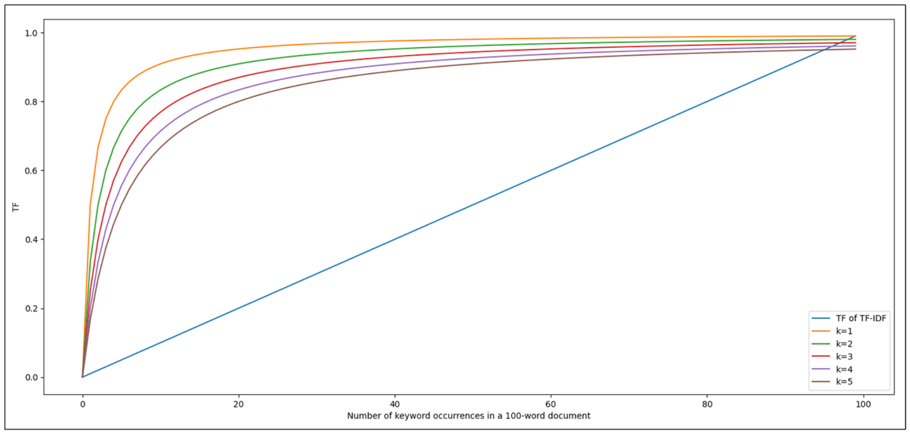
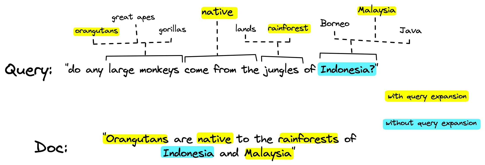
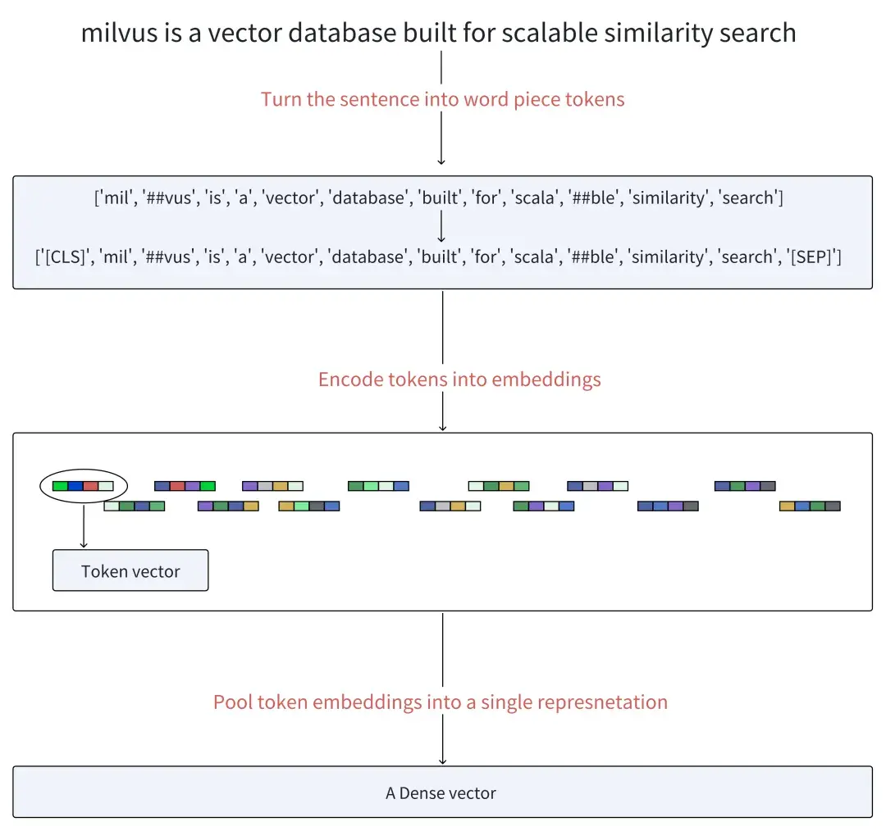
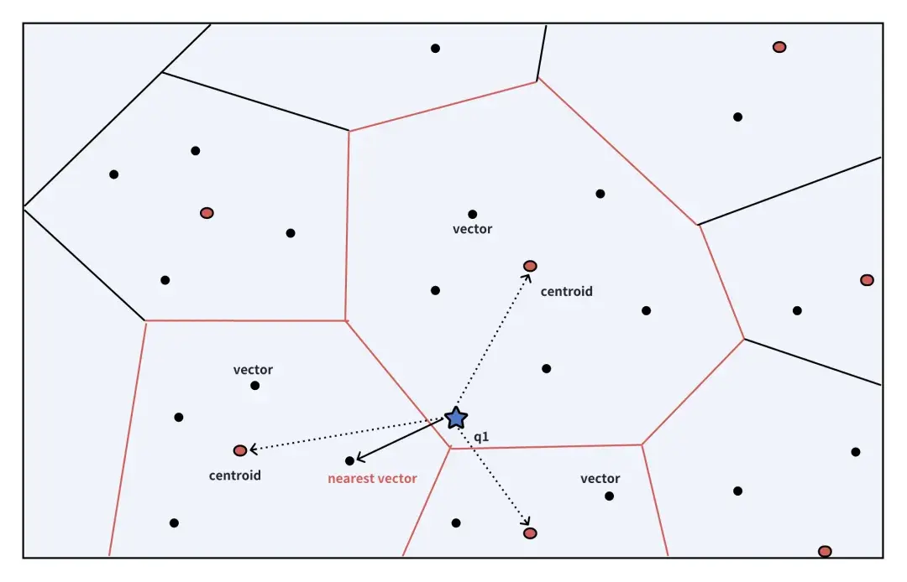
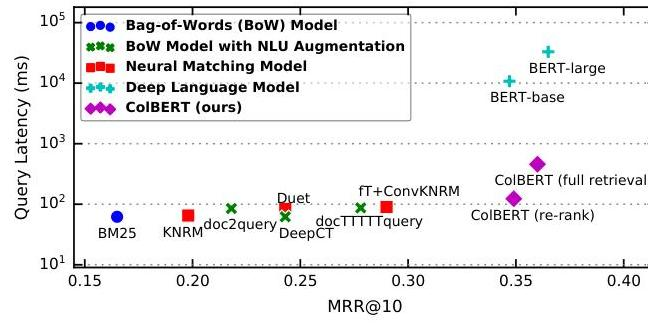

# 向量表示与检索技术：从传统方法到现代挑战

在大模型时代，数据的向量化表示已经成为智能系统的核心基础设施。本章将深入探讨向量检索技术的发展脉络，从经典的TF-IDF、BM25算法，到现代的SPLADE、ColBERT模型，最后分析Meta论文揭示的向量嵌入理论限制。

## 本章结构
1. **基础检索算法**：TF-IDF、BM25的原理与演进
2. **现代稀疏向量方法**：SPLADE的语义扩展能力  
3. **稠密向量检索**：ColBERT架构与后期交互机制
4. **理论边界探索**：Meta论文对嵌入模型根本限制的分析
5. **实践与应用**：(　o=^•ェ•)o🍚

关于更多的基础知识（比如BERT），强烈推荐去看宋博大佬的[Happy-LLM教程](https://datawhalechina.github.io/happy-llm/#/./chapter1/%E7%AC%AC%E4%B8%80%E7%AB%A0%20NLP%E5%9F%BA%E7%A1%80%E6%A6%82%E5%BF%B5)，建议你看完这个hayyp-llm以及FusionANNS后再来看现在的这篇文章。

## 向量数据库：从"数据存储"到"语义理解"的范式跃迁

向量库和传统的数据库有什么区别呢，比如milvus和mysql；表面上看，向量数据库只是一种新型的数据存储方式，把原本存储的数据字段转换为了embedding表示进行存储，貌似mysql也可以做到这一点，对吗？

我们根据参考文章1里面的表述来说，**向量库不是传统数据库的一个补丁，而是一套完全不同的基础设施逻辑**。数据库不仅是一个存储工具，更重要的是提供了一种更加高效的数据组织方式和检索机制，传统数据库以字段为中心组织数据，以结构化规则进行索引和调用，其核心是精确匹配与关系建模。

而向量数据库的逻辑，完全不一样。
在传统数据系统中，数据核心单位是 "值"（如 "姓名 = 张三""城市 = 北京"），数据库围绕 "值" 展开精确匹配工作。而向量化是将文本、图像、视频、用户行为等内容，通过训练转化为一组能表示其语义信息的高维数字（即向量），且 "语义相近" 的内容在向量空间中 "距离相近"。可类比为：若语义是地图，向量就是坐标，语义相近的内容会在向量空间中映射到相近位置，例如 "咖啡馆""星巴克""拿铁" 在向量空间中彼此靠近，因它们共享 "饮品""场所""消费场景" 等语义。

向量化让机器首次具备 "语义敏感性"，不再是简单核查 "关键词是否对得上"，而是判断 "用户需求意图"。这不仅大幅提升模型感知能力，还重构 "数据可用性" 定义：未来关键不再是 "有没有数据"，而是 "数据能否清晰表达、是否符合人类语义理解逻辑"，实现从 "结构值" 到 "语义空间" 的范式跃迁。

比如：在一场智能客服对话中，模型可能在第7轮推理时，才意识到需要"补调"用户过往投诉记录；

在一次RAG（检索增强生成）中，模型会根据生成内容，动态触发多次数据检索；

这些都要求数据系统不仅能"查得快"，还要"理解上下文意图"，具备语义理解+模型联动+实时响应的能力，而这正是传统数据库所不具备的。

在生成式 AI 时代，对话生成、内容推荐、智能搜索、Agent 调度等核心能力，都需建立在 "可语义调用" 的数据底座上，而该底座无法靠传统数据库补齐，必须是 "为语义理解而生、为模型协同而建" 新型基础设施。因此，向量数据库是 AI 语义世界的 "根服务器"，是智能系统的 "地基"。

在大模型时代，企业进行数据化的核心任务之一就是建设"数据湖"————把分散到各个业务系统中的结构化、半结构化、非结构化数据统一存储、集中治理，为未来的分析建模打下基础。但问题随之而来，企业只是片面的存储了数据，却不能很好的处理或者理解这些数据，你可能会想，企业会拿这些数据进行整理和展示，但对于我们人或者说大模型来说，我们还是需要进行组织和理解，这就是数据湖的边界，擅长存储而不擅长组织，可以让数据可用，但无法让数据对我们来说是"可感知的"。而向量化改变了这一切，在传统系统中，数据是以字段和表格存在的，它们更像是"字典"或"仓库"，只能在人工检索或程序调用下"被使用"，但当数据被向量化，它就被重新编码为模型可以"理解、联想、推理"的语义单元——换句话说，它从"存量资源"变成了"认知燃料"，一段用户评论、一篇产品介绍、一张商品图像，在被转换为向量后，能成为模型主动理解用户需求、生成回答、预测行为的基础材料。它们不是"等着被查"的记录，而是"参与对话"的智能组件。

当大模型成为智能化转型的技术引擎，越来越多企业开始构建自己的模型能力、部署Agent系统、探索RAG方案……但很多人在兴奋中忽略了一个问题：拥有一个大模型，并不等于拥有一个真正的智能系统，如果你的数据系统还停留在"字段匹配""冷存热查"的阶段，如果你的知识体系无法被模型准确理解、快速调用，那么再强大的模型也只能在信息荒原中"闭门造车"，真正的智能生态，必须建立在被结构化、被语义化、被上下文感知的数据世界之上，这就是语义基础设施的意义：它不是让你存更多数据，而是让你的数据真正"被理解""被激活""被调用"。

### TF-IDF：从"词频统计"到"语义权重"的经典算法

想象一下，你是一位图书管理员，面对成千上万本书，当读者询问"人工智能相关的书籍"时，你会如何快速找到最相关的资料？简单的关键词匹配可能会返回大量包含“的”、“是”等常见词的无关书籍。我们需要一种更智能的方法来评估词语的“重要性”。

TF-IDF（Term Frequency-Inverse Document Frequency，词频-逆文档频率）就是解决这个问题的经典算法。它不仅仅是简单的词频统计，而是一套智能的“重要性评估体系”，旨在量化一个词语对于文档集合中某份文档的代表程度。

#### TF-IDF的核心思想

TF-IDF基于一个朴素而深刻的假设：**一个词对文档的重要性，既取决于它在该文档中出现的频率，也取决于它在整个文档集合中的稀有程度。**

这就像评价一个人的专业能力：

*   如果他在某个项目中频繁发挥作用（高TF），说明他对该项目贡献良多。
*   同时这种能力在团队中比较稀缺（高IDF），说明他的技能具有独特的价值。
*   那么他对这个项目就特别重要（高TF-IDF），因为他不仅参与多，而且提供的还是稀缺的价值。

#### 算法的两个核心组件

TF-IDF的计算通常由两个主要部分构成：

1.  **词频（TF - Term Frequency）**
    衡量词汇在单个文档中的重要性。一个词在文档中出现得越频繁，说明它对该文档越重要。计算TF的方法有很多种，最常见的是简单计数，即词语在文档中出现的次数。更复杂的版本可能会考虑词频的对数缩放或频率归一化，以避免长文档对TF值的过度影响。例如，如果词 $t$ 在文档 $d$ 中出现的次数为 $count(t, d)$，文档 $d$ 的总词数为 $N_d$，则：
    $$
    TF(t, d) = \frac{count(t, d)}{N_d}
    $$
    或者采用对数形式：
    $$
    TF(t, d) = 1 + \log(count(t, d)) \text{ (当 } count(t, d) > 0 \text{)}
    $$
    
    **文档词频归一化**
    为了避免长文档天生就有的更高的词频，导致权重被夸大，我们将原始词频除以文档的总词数Nd
    $$
    TF(t, d) = \frac{count(t, d)}{N_d}
    $$
    这样，无论文档多长，词频都被缩放到0到1之间，更好地反映了词语在该文档内容中所占的比例。例如，猫这个字在1000个字中的文档中只出现了5次，那么TF值为：
    $$
    TF(猫, d) = \frac{5}{1000} = 0.005
    $$

    那么TF值为：5/1000=0.005，

    **对数词频缩放** 
    另一种常见的处理方式是对词频取对数，以减缓词频增长带来的权重增加。这意味着词语出现次数从10次到20次的影响，要比从1次到10次的影响小。
    $$ 
    TF(t, d) = 1 + \log(count(t, d)) \text{ (当 } count(t, d) > 0 \text{)}
    $$
    这里的+1是为了确保当词频为1时，对数词频不为0，避免log(0)的计算，这种方法可以平滑的处理高频词，防止这些高频词对TF-IDF产生过大的主导作用。

2.  **逆文档频率（IDF - Inverse Document Frequency）**
    衡量词汇在整个文档集合中的稀有程度。如果一个词在很多文档中都出现，那么它的区分能力就较弱（比如“的”、“是”、“了”）；相反，只在少数文档中出现的词往往更有价值。
    IDF的关键在于识别那些信息量大的词，一个词如果在很多文档中都出现，那么它对于区分不同文档的帮助就很小。比如，“电脑”这个词在所有的IT相关的文档中都会出现，但它不能帮助我们区分一篇关于“硬件”的文档和一篇关于“软件”的文档。而像“量子纠缠”这样的词，一旦出现，就很有可能指向一篇特定的物理学文档。
    
    IDF的计算公式为：
    $$
    IDF(t) = \log\left(\frac{N}{DF(t) + 1}\right)
    $$

    * N代表文档集合中的总文档数量
    * DF（t）代表包含词t的文档数量
    * 分母中的+1是一个平滑因子，主要是为了避免在词t在文档集合中从未出现过（即DF（t）=0）时，IDF(t)的值为0，导致TF-IDF(t,d)的值也为0。从而使计算能够正常进行。同时也轻微的减少那些非常稀有的词语的IDF值过高的问题。

最终，一个词的TF-IDF权重可以计算为，其TF值和IDF值相乘：
$$
TF-IDF(t, d) = TF(t, d) \times IDF(t)
$$

#### 为什么TF-IDF如此重要？

TF-IDF巧妙地平衡了“局部重要性”和“全局稀有性”，使其在信息检索和文本挖掘领域具有广泛的应用价值：

*   **惩罚常见词**：像“的”、“是”这样的高频词在许多文档中都会出现，它们的DF值会非常高，导致IDF值接近于零，也就是非常小。因此即使这些词的TF很高，其最终的TF-IDF值也会很低，从而被有效的降权，这使得算法可以忽略这些词对文档的贡献，专注于那些更具信息量的词，比如说上文提到的“量子纠缠”。
*   **突出关键词**：那些在当前文档中频繁出现（高TF），但在整个文档集合中相对稀有（高IDF）的词会得到最高的TF-IDF分数，这些次雨往往是关键词，它们往往代表文档的主题或内容。例如，在一篇关于“量子计算”的论文中，“量子计算”的TF会很高，同时由于它不是所有文档都常见的词，IDF也会相对较高，最终导致TF-IDF值很高。
*   **提供可解释性**：每个词的重要性都有明确的数学依据和直观的解释。我们可以清楚地看到一个词为什么重要（因为它在这篇文章里多，在所有文章里少），这使得TF-IDF模型的结果比一些“黑箱”模型更容易理解和验证。
*   **基石作用**：用户输入查询词时，搜索引擎会计算查询词与每个文档的TF-IDF相似度。通常，这通过计算查询词向量和文档词向量的余弦相似度来实现，其中向量的每个维度代表一个词语的TF-IDF值。余弦相似度可以衡量两个向量方向的相似性，从而判断查询与文档内容的匹配程度。然后，系统会按相关性排序，将最匹配的文档呈现给用户。

---

### BM25：从TF-IDF到智能检索的进化之路

#### TF-IDF的局限性：为什么需要BM25？

在BM25诞生之前，TF-IDF是信息检索领域的主流算法。然而，随着应用场景的复杂化，TF-IDF暴露出两个关键缺陷，这些缺陷在处理大量多样化文本时尤其明显：

1.  **文档长度偏见问题**
    TF-IDF在计算词频时，仅统计关键词出现次数而未有效考虑文档总长度的影响。这会导致一个明显的不公平现象：
    *   在一段1000词的文档中，“兔子”出现10次，其词频（TF）为 $\frac{10}{1000} = 0.01$。
    *   在一段10词的文档中，“兔子”出现1次，其词频（TF）为 $\frac{1}{10} = 0.1$。

    尽管从比例上看，后者的“兔子”出现频率更高，似乎更聚焦于该主题，TF-IDF的原始TF计算却无法有效捕捉这种“主题聚焦度”。一个非常长的文档，即使某个词只是偶尔出现，由于文档总长度大，其原始计数也可能高于一个短文档中频繁出现的词，这可能导致系统错误地认为长文档更相关，即便它的主题分布非常广泛。这就像一本百科全书可能多次提到“人工智能”，但一篇专门的期刊论文可能只聚焦于“深度学习”这个更具体的子领域，虽然前者提到“人工智能”的次数多，但后者的“深度学习”可能对特定查询更相关。

2.  **关键词饱和问题**
    TF-IDF的权重随词频呈线性增长，这意味着词语出现次数越多，其权重就越高，这在极端情况下会产生不合理的结果：
    *   例如，某个关键词出现200次已足以明确该文档的主题。
    *   但如果该关键词出现400次，TF-IDF的权重仍会是200次的2倍。
    实际上，在一定程度上，一个词的重复出现确实能增强文档与该词的相关性。然而，这种相关性的提升并不是无限的线性关系。超过某个阈值后，额外的出现次数对文档主题的确定性或相关性的提升微乎其微，甚至可能仅仅是文本冗余。想象一下，一篇文章提到“苹果”10次，我们已经很清楚它在讨论“苹果”。如果它提到“苹果”1000次，我们不会觉得它比提到10次的文章“更像”关于“苹果”的文章，反而可能觉得它在重复。TF-IDF的线性增长无法模拟这种“饱和效应”。

#### BM25的核心理念：智能的"门外汉医生"

想象你感冒去医院，医生会根据症状判断病因并给出诊断。但如果你告诉医生"我不能理解FusionANNS的架构设计"，医生大概会建议你去精神科挂号——因为这超出了他的专业领域。

**BM25就像一位聪明的"门外汉医生"**：虽然不深度理解专业内容，但能够通过巧妙的方法帮你找到最相关的信息。它不会尝试理解词语背后的深层含义，而是通过优化词频和文档长度的权重计算，更**智能地评估文档的表面相关性**，从而比TF-IDF更有效地筛选出真正匹配用户查询的文档。

#### BM25的解决方案：一个更聪明的公式

BM25是一个评分函数，它结合了TF-IDF的思想，但通过引入**非线性词频饱和**和**文档长度归一化**来解决上述局限性。BM25的完整公式（通常是BM25的TF部分与IDF部分的乘积）如下：

$$
Score(D, Q) = \sum_{t \in Q} IDF(t) \cdot \frac{TF(t, D) \cdot (k_1 + 1)}{TF(t, D) + k_1 \cdot \left(1 - b + b \cdot \frac{|D|}{avgdl}\right)}
$$

其中：
*   $Score(D, Q)$ 表示文档 $D$ 相对于查询 $Q$ 的BM25得分。
*   $t \in Q$ 表示对查询 $Q$ 中的每个词 $t$ 进行求和。
*   $IDF(t)$ 的计算与TF-IDF中的逆文档频率类似，用于衡量词语的稀有程度。

核心的改进体现在对词频部分的处理：

1.  **解决关键词饱和问题：非线性词频函数**
    BM25在其词频（TF）等式中引入了一个新的非线性饱和函数，而不是仅仅依赖于关键词的出现次数：

    $$
    \frac{TF(t, D) \cdot (k_1 + 1)}{TF(t, D) + k_1 \cdot \left(1 - b + b \cdot \frac{|D|}{avgdl}\right)}
    $$

    这个复杂的分子和分母结构，特别是其中的参数 $k_1$，是控制词频饱和度的核心。
    
    正如您所见，前几次关键词出现对整体TF分数的影响很大，导致分数迅速上升。然而，随着关键词在文档中出现的次数（$TF(t, D)$）越来越多，它对整体TF分数的贡献增长会逐渐变慢，最终趋于平稳，达到“饱和”。这模拟了人类对信息感知的特点：第一次读到某个关键词印象深刻，第二次、第三次仍有帮助，但读到第N次时，再多读几次并不会显著增加我们对文档主题的理解。

    *   **参数 $k_1$ 的作用**：$k_1$ 是一个正数，通常取值在 $1.2$ 到 $2.0$ 之间。它控制着词频饱和的速度。
        *   $k_1$ 值越小，饱和曲线越陡峭，意味着词频很快就会达到饱和，额外的出现次数对分数提升的影响越小。
        *   $k_1$ 值越大，饱和曲线越平缓，意味着词频对分数的贡献持续时间更长，对高频词的惩罚相对较轻。

    **这有效解决了与TF-IDF相关的关键词饱和的缺点**，使得高频词的权重不会无限膨胀，更合理地反映其对文档相关性的贡献。

2.  **解决文档长度偏见问题：文档长度归一化**
    与传统TF-IDF相比，BM25的另一个基本改进是它**考虑了文档长度**。这是通过词频分母中的这一部分实现的：

    $$
    \left(1 - b + b \cdot \frac{|D|}{avgdl}\right)
    $$

    *   **$|D|$ (或 $L_D$)**：指的是**当前文档 $D$ 的长度**（即该文档的词数）。
    *   **$avgdl$**：指的是**整个文档集合的平均长度**。
    *   **$\frac{|D|}{avgdl}$**：计算的是当前文档长度与平均长度的**比值**。
        *   如果这个比值大于1，表示当前文档比平均文档长。
        *   如果小于1，表示当前文档比平均文档短。
        *   如果等于1，表示当前文档长度与平均长度相当。

    
    这张图形象地展示了文档长度归一化如何调整词频。例如，一个包含一个关键词的10个单词的文档（短文档，可能比平均长度短很多）将比包含10个关键词的1000个单词的文档（长文档）获得更高的相关性分数，前提是短文档中的关键词出现比例更高。BM25通过这种机制，能够更好地识别那些虽然短小精悍，但主题高度集中的文档。

    *   **参数 $b$ 的作用**：$b$ 是一个介于 $0$ 和 $1$ 之间的参数，通常取值在 $0.75$ 左右。它控制着文档长度归一化的强度。
        *   如果 $b=0$，则 $(1 - 0 + 0 \cdot \frac{|D|}{avgdl}) = 1$，此时文档长度因素完全被忽略，BM25的行为更接近原始的TF-IDF（但仍有词频饱和）。
        *   如果 $b=1$，则 $(1 - 1 + 1 \cdot \frac{|D|}{avgdl}) = \frac{|D|}{avgdl}$，此时长度影响最大化，文档长度的比例直接用于调整词频的分母。
        *   适中的 $b$ 值（如0.75）可以在忽略长度影响和完全归一化之间找到一个平衡点。

    **最终效果：** 如果一个文档很长（比如一篇冗长的论文），它的 $\frac{|D|}{avgdl}$ 比值会很大，导致 $\left(1 - b + b \cdot \frac{|D|}{avgdl}\right)$ 的值变大。这个值作为分母的一部分，会**降低**整个词频函数的结果。这意味着BM25会对长文档进行一定的“惩罚”或“去权重”，因为它认为长文档中关键词出现的密度可能不如短文档高。这种机制能让内容更集中、更相关的短文档（比如一个精准的定义或摘要）也能获得公平甚至更高的分数，即使它们的原始词频计数可能不如长文档高。

BM25通过引入这些可调节的参数 $k_1$ 和 $b$，提供了一个比TF-IDF更灵活、更智能的排序算法，它能够更好地适应不同语料库的特性和查询需求，从而在现代搜索引擎和信息检索系统中扮演了非常重要的角色。

代码使用了下面的Reference链接4. [外行如何速成专家？Embedding之BM25、splade稀疏向量解读](https://zhuanlan.zhihu.com/p/12259283617), 这篇文章写的非常好。

代码：[点这里](./code/colBert/zmilvus.ipynb)

---
您的关于SPLADE的描述非常精彩，尤其是“刚入门的新人”的比喻，形象地说明了它在语义理解上的优势。对稀疏向量和稠密向量的区分，以及对维度和长度的解释也非常到位，解决了潜在的混淆。

以下是对您提供的文本的修订和补充，旨在进一步阐释那些可能显得“晦涩难懂”的概念，特别是SPLADE如何做到“举一反三”和它的一些技术细节。

---

## 超越“单向量”表示的方法

传统的文本匹配方法，如TF-IDF和BM25，主要依赖于关键词的字面重叠。它们非常高效，但在理解词语的**深层语义**和处理**词汇不匹配问题**时会遇到瓶颈。为了克服这些局限性，研究人员转向了更智能的文本表示方法，其中之一就是基于学习的稀疏向量——SPLADE。

### SPLADE：从字面匹配到语义扩展的稀疏向量

如果说BM25是聪明的门外汉，通过精心设计的统计方法来评估词语的重要性，那么**学习得到的稀疏向量SPLADE就是一位“刚入门的新人”——它通过训练理解领域内专业术语的语义，而且能够举一反三，增加更多语义相近的词，一起查找**。这使得它在检索时能超越字面匹配，捕捉更深层次的相关性。

例如，对于查询“人工智能如何影响汽车行业”，SPLADE不仅会识别“人工智能”和“汽车”这两个词，还会**语义扩展**，将与“人工智能”相似的“AI”、“机器学习”等词，以及与“汽车行业”相关的“自动驾驶”、“电动车”等词也纳入考虑，从而拓宽搜索范围。

#### SPLADE的工作原理：基于BERT的语义扩展

SPLADE的核心思想是利用大型语言模型的强大能力，将文档或查询映射成一个高维的**稀疏向量**。这个稀疏向量的维度对应于一个巨大的**词汇表**（或称为词典），这个词汇表通常来源于预训练的语言模型，如BERT的词汇表，而不是像BM25那样根据具体的文档集合统计而来。这意味着SPLADE拥有一个预先构建好的、包含大量通用词语和概念的“知识库”。

*   **BERT的词汇表**：BERT（Bidirectional Encoder Representations from Transformers）是一个在海量文本数据上预训练的深度学习模型。它的词汇表包含了数万甚至数十万个词元（token），这些词元可以是完整的单词、单词的一部分（子词）或特殊符号。SPLADE利用这个预训练好的、具有丰富语义信息的词汇表，使得其生成的稀疏向量能够表示更广泛的语义概念。

接下来，SPLADE生成这些单词的稀疏向量。它会计算文档中每个原始单词对词汇表中每个位置（即每个词元）的“贡献”或“激活强度”。**也就是说，文档中的单词和词汇表中某个词元在语义上越接近，计算得到的权重就越大。这个权重就是单词在对应词元维度上的“重要性分数”**。

以“人工智能”为例，假设词汇表中第5个词也是“人工智能”，两个词完全一样，计算得到的权重就很高，比如40%。而词汇表第8个词是“机器学习”，两个词比较相似，SPLADE会识别出这种语义关联，给出20%的权重。而词汇表中其他的词和“人工智能”语义相差较远，它们的权重就很小，可以忽略不计（这就是稀疏性的来源）。最终，“人工智能”这个概念的权重可以被分解和汇总到多个相关的词元维度上。

经过这种处理后，一个文档或查询不再仅仅由它自身的原始词语表示，而是由一个包含了**语义扩展后**的词语和对应权重的稀疏向量表示。例如，对于查询“人工智能如何影响汽车行业”，生成的稀疏向量可能看起来像这样：

`sparse_vector = {"人工智能": 0.6,"AI": 0.5,"机器学习": 0.3, "自动驾驶": 0.2, "电动车": 0.1, "汽车": 0.1}` 

这个向量中的非零值对应了与原始查询语义相关的所有扩展词，它们的权重则反映了其相对重要性。

#### 稀疏向量 vs 稠密向量

这里我们区分一下两种常见的向量表示方式：

*   **稀疏向量**：具有高维度，但包含的非零值非常少（因此得名“稀疏”）。TF-IDF 或 BM25 生成的向量就是典型的稀疏向量，它们的维度通常是词汇表的大小，而一个文档只包含词汇表中的一小部分词，稀疏向量已有数十年的研究历史，由此产生了紧凑的数据结构和许多专门针对这类向量设计的高效检索算法（例如倒排索引），它们在处理大规模文本数据时非常高效。
*   **稠密向量**：维度相对较低，但包含丰富信息，大多数或全部维度都包含非零值。这些向量通常由神经网络模型（如Transformer）构建，例如BERT、Sentence-BERT等模型生成的嵌入向量， 稠密向量能够表示更抽象的信息，例如文本的语义含义、上下文关系等，因为每个维度都可能编码了某个特征。它们的优势在于捕捉语义相似性，即使两个句子没有共享任何词语，它们的稠密向量也可能非常接近。

> **向量的维度和长度的辨析：**
> （加强记忆防止忘记）
> 向量的维度指的是表示该向量所需数字的数量，例如一个 `[x, y, z]` 中有三个数字，那大概率就是一个三维向量。从空间角度来说，维度代表了向量所在空间的自由度，比如二维向量有两个坐标，三维向量有三个坐标。
> 而向量的长度（也称为模）是一个标量值，表示向量的大小。在二维空间中，向量 $\vec{v}=(x,y)$ 的长度可通过公式 $\|\vec{v}\| = \sqrt{x^2 + y^2}$ 计算；在三维空间中，向量 $\vec{u}=(x,y,z)$ 的长度为 $\|\vec{u}\| = \sqrt{x^2 + y^2 + z^2}$。对于高维向量，其长度计算方式也是各坐标分量平方和的平方根。
> 所以，维度描述的是向量的结构属性（有多少个分量），长度描述的是向量的大小属性（向量在空间中的“多长”）。

#### SPLADE的显著优势：缓解词汇不匹配问题

SPLADE最显著的优势在于其**举一反三式的学习**，它利用语言模型来学习词项扩展，甚至可以根据上下文进行微调。在传统的基于TF-IDF或BM25的匹配过程中，查询和文档中尽管包含很多相关的词，但由于不是精确匹配，这些方法可能无法识别到其深层关联。

这张图形象地展示了传统匹配方法的局限性。当查询和文档使用不同的词语表达相同或相似的概念时（即“词汇不匹配”或“词汇鸿沟”问题），传统的字面匹配方法会失败。

**词项扩展**对于缓解词汇不匹配问题至关重要。对于需要查询文档的场景下，用户的问题往往不能准确地匹配到某个或者某几个文档里面的某个具体描述，这是查询和相关文档之间缺乏词项重叠的现象。

通过对查询中词项的扩展，我们将获得更大的重叠度（语义上的重叠），这样就可以搜索到更多语义上相关的文档，即使它们之间没有直接的关键词重叠。

由于语言的复杂性和对描述某一事物可能同时存在不同的方式，相关文档和查询之间可能存在很少甚至没有词项重叠的情况，这是可以预期的。词项扩展正是为了解决这一问题。在某些实际应用中，对于用户的对同一问题的不同语言描述情况，往往还会加上一个意图识别和意图增强模型重构用户的查询，这样可以定位到需要查询的collection上，减少查询的召回范围，并且可以提高召回数据的质量。

#### SPLADE如何做到“举一反三”：Masked Language Modeling的启发

至于SPLADE是如何做到“举一反三”的，我们可以参考**Happy-LLM中关于Masked Language Modeling (MLM)**的介绍，其核心思想是相通的。

**补充说明：**
SPLADE是基于Transformer架构的语言模型（如BERT）进行训练的。BERT在预训练阶段使用了MLM任务：它会随机遮盖（mask）输入文本中的一些词语，然后让模型去预测这些被遮盖的词语是什么。为了完成这个任务，模型需要：
1.  **理解上下文**：模型需要根据被遮盖词语前后的词语来推断其含义。
2.  **学习词语的语义关系**：模型会学习到哪些词语经常一起出现，哪些词语是同义词或近义词。

SPLADE模型在训练时，通过一个特定的层（通常是最后一层Transformer层之后的全连接层）将上下文敏感的词嵌入（contextualized word embeddings）映射到整个词汇表的维度上。这个映射过程会激活与输入词语语义相关的多个词元维度，并且赋予它们权重。例如，当输入“人工智能”时，模型不仅会激活“人工智能”对应的维度，还会因为训练中学到的语义关联而激活“AI”、“机器学习”等维度。这个激活强度，经过归一化和稀疏化处理，就成为了SPLADE向量中的权重。

**简单来说，SPLADE通过模仿BERT在预测被遮盖词时的“联想”能力，将这种联想过程显式地体现在生成的稀疏向量中，从而实现了语义上的“举一反三”和词项扩展。**

#### SPLADE的不足之处

SPLADE是缓解稀疏向量方法常见词汇不匹配问题的一种优秀方法。然而，我们还需要考虑它的一些局限性。

相较于其他稀疏方法（如TF-IDF或BM25），使用SPLADE进行检索速度相对较慢。这主要有三个原因：

1.  **SPLADE查询和文档向量中的非零值数量通常多于传统稀疏向量**：TF-IDF和BM25通常只为文档中实际出现的词分配非零权重。而SPLADE由于进行了词项扩展，即使文档中没有直接出现某个词，只要它与文档内容语义相关，其对应维度也可能获得非零权重。这导致SPLADE向量的稀疏度相对较低（非零值更多），而现有的稀疏检索系统并未针对这种“不那么稀疏”的向量进行优化。
2.  **非零值的分布偏离了传统稀疏检索系统所预期的分布**：传统的稀疏检索系统（如倒排索引）通常假设非零值集中在文档中实际出现的少数关键词上。SPLADE的权重分布可能更分散，覆盖了更广泛的语义相关词元，这使得传统的索引和检索策略效率降低。
3.  **大多数稀疏检索系统不原生支持SPLADE向量**：这意味着我们必须执行多步预处理和后处理。例如，为了适应传统的检索系统，可能需要对SPLADE向量的权重进行**离散化**（将连续的权重值映射到有限的离散值上，甚至二值化），或者进行额外的稀疏化操作，这增加了计算的复杂性和时间开销。

尽管存在这些挑战，SPLADE依然代表了信息检索领域的一个重要进步，它结合了传统稀疏方法的解释性和神经网络模型强大的语义理解能力。

SPLADE 代码实践[点这里](./code/colBert/zzmilvus.ipynb)

综合对比[点这里](./code/colBert/zzzmilvus.ipynb)

---

## 稠密向量检索：迈向语义理解的新范式

传统的检索方法，如TF-IDF和BM25，虽然高效，但在处理查询和文档之间的复杂语义关系时存在局限性。它们主要依赖于词语的字面匹配和统计特性。为了实现更深层次的语义理解和更精确的检索，研究人员转向了**稠密向量检索**，其中ColBERT及其优化版本ColBERTv2是该领域的代表性模型。

### ColBERT：专为高效相似性搜索而设计的创新型嵌入和排序模型

#### 简要回顾BERT

BERT（Bidirectional Encoder Representations from Transformers）是一种基于Transformer架构的强大语言模型。它通过对大量文本数据进行预训练，学习到词语在不同上下文中的深层语义表示。

这张图展示了BERT如何将文本转化为向量：
1.  **分词 (Tokenization)**：首先，输入的句子会被分解成一系列的词元（tokens）。这些词元可以是完整的单词，也可以是单词的一部分（子词），或者特殊符号（如 `[CLS]` 和 `[SEP]`）。`[CLS]` 符号通常加在句子开头，其对应的最终向量常用于表示整个句子的信息；`[SEP]` 用于分隔不同的句子。
2.  **嵌入 (Embedding)**：每个词元被转换成一个初始的向量表示。这个过程涉及到三种嵌入的叠加：
    *   **Token Embeddings**：词元本身的语义表示。
    *   **Segment Embeddings**：用于区分输入是句子A还是句子B（在一些任务中，如问答，需要同时输入两个句子）。
    *   **Position Embeddings**：为了弥补Transformer模型本身不具备处理序列位置信息的缺点，加入位置编码，让模型知道每个词元在句子中的位置。
3.  **基于Transformer的编码 (Transformer Encoding)**：这些初始嵌入向量随后经过多层Transformer编码器。Transformer的核心是**注意力机制（Attention Mechanism）**，它允许模型在处理一个词元时，同时“关注”到序列中所有其他词元，并根据上下文信息对当前词元的表示进行细化。通过多层编码，每个词元都能捕获到丰富的上下文信息。
4.  **池化操作 (Pooling Operation)**：传统的BERT在许多任务中，最终会将所有词元向量转化成**单一的稠密向量**来表示整个句子。
    > 这个“池化操作”通常指的是取 `[CLS]` 词元对应的最终输出向量，或者对所有词元向量进行平均等操作。这个单一向量旨在捕 整个句子的整体语义信息。这种“一句话对应一个向量”的表示方式在某些任务（如句子分类、语义相似度匹配）中非常有效。

传统的BERT将所有词元向量合并为单一向量表示，即一句话对应一个向量。然而，ColBERT基于BERT进行了深度创新，它**保留了每个词元的表示，提供了一个向量的列表**，并进一步优化了查询中的每个词元与文档中的每个词元之间的相关性计算。ColBERT的独特之处在于引入了一种**后期交互机制（Late Interaction）**，这种机制**通过在检索过程的最终阶段之前分别处理查询和文档**，从而实现高效和精确的排名和检索。

#### ColBERT架构

ColBERT包含三个核心组件，它们协同工作以实现高效且精确的稠密向量检索：

1.  **查询编码器（Query Encoder）**
    查询编码器负责将用户查询转换为一组固定大小的嵌入向量。与传统的BERT模型不同，ColBERT的查询编码器不会将整个查询压缩为单一向量，而是**为查询中的每个词元生成独立的向量表示**。这种设计使得模型能够保留查询中每个词汇的细粒度语义信息，例如，查询“最新款手机”会被编码为 `[v_最新, v_款, v_手机]` 这样的向量列表。

2.  **文档编码器（Document Encoder）**
    文档编码器采用与查询编码器相同的架构，将文档内容转换为另一组嵌入向量。文档编码器同样为文档中的每个词元生成独立的向量表示，确保文档的语义信息得到充分保留。例如，文档“苹果公司发布了最新款iPhone”会被编码为 `[u_苹果, u_公司, u_发布, u_了, u_最新, u_款, u_iPhone]` 这样的向量列表。

3.  **后期交互机制（Late Interaction）**
    后期交互是ColBERT的核心创新，它允许查询和文档在编码阶段完全独立处理，只在最后的相似度计算阶段进行交互。这种设计带来了两个重要优势：
    *   **离线预计算**：由于查询和文档编码是独立的，文档编码可以**预先计算并存储**在索引中，这大大减少了在线查询时的计算开销，因为每次查询到来时，只需编码查询本身，而无需重新编码所有文档。
    *   **细粒度匹配**：每个查询词元都能与文档中的所有词元进行相似度计算，实现更精确的语义匹配，这比仅仅比较两个单一的句子向量要精细得多。

**编码器工作原理**
ColBERT的编码器基于BERT架构，但进行了重要改进以适应其后期交互的需求。编码器不仅考虑词元本身的语义，还通过注意力机制捕获词元在上下文中的关系。比如在句子"苹果很甜"中，"苹果"的向量表示会融合"很甜"的语义信息，从而使其向量更倾向于表示"水果"而非"科技公司"的含义。

具体来说，查询编码器输出的每个向量 $E_Q = \{q_1, q_2, \ldots, q_n\}$ 都包含了查询 $Q$ 中该词与其他词之间的语义关系信息，文档编码器输出的每个向量 $E_D = \{d_1, d_2, \ldots, d_m\}$ 都包含了文档 $D$ 中该词与其他词之间的语义关系信息。这种上下文感知的表示使得ColBERT能够更准确地理解词汇在特定语境下的真实含义。

有了查询向量组 $E_Q$ 和文档向量组 $E_D$，ColBERT需要计算它们之间的相关性。这里采用了一种叫做"后期交互"的巧妙方法。

**什么是后期交互？**

想象你是一个翻译，需要将中文句子"我喜欢吃苹果"翻译成英文。传统方法是先理解整句话的意思，然后翻译成"I like eating apples"。

而ColBERT的后期交互就像是：
1.  先分别“理解”中文的每个词的含义（生成独立的词元向量）：我→(向量1)，喜欢→(向量2)，吃→(向量3)，苹果→(向量4)。
2.  同时，也分别“理解”英文的每个词的含义：I→(向量A)，like→(向量B)，eating→(向量C)，apples→(向量D)。
3.  然后让每个中文词的向量去和英文句子的**所有**词向量计算相似度，找出最高分。例如，中文“苹果”的向量会和英文“I”、“like”、“eating”、“apples”的向量分别计算相似度，找出与“apples”的最高相似度。
4.  最后，把所有中文词的最佳匹配分数加起来，得到最终的句子相似度分数。

**具体计算过程：**

假设查询 $Q$=“人工智能应用”被编码为3个向量：$\{q_1, q_2, q_3\}$ (对应“人工”，“智能”，“应用”)。
文档 $D$=“AI技术在医疗领域的广泛应用”被编码为8个向量：$\{d_1, d_2, \ldots, d_8\}$ (对应“AI”，“技术”，“在”，“医疗”，“领域”，“的”，“广泛”，“应用”)。

ColBERT会这样计算相关性，通常采用**最大内积（MaxSim）**操作：
$$
Score(Q, D) = \sum_{q \in Q} \max_{d \in D} (q \cdot d)
$$
这意味着：
1.  查询词“人工” ($q_1$) 与文档中所有词的向量（$d_1, \ldots, d_8$）计算内积（相似度），找出最高分（例如，与“AI” $d_1$ 最相似）。
2.  查询词“智能” ($q_2$) 与文档中所有词的向量计算内积，找出最高分（例如，可能与“技术” $d_2$ 或“AI” $d_1$ 相似）。
3.  查询词“应用” ($q_3$) 与文档中所有词的向量计算内积，找出最高分（例如，与“应用” $d_8$ 最相似）。
4.  将这三个最高分相加，得到最终的相关性分数 $Score(Q, D)$。

这种方法的优势是：每个查询词都能在文档中找到语义上最佳匹配的词，即使用词不完全一样，也能通过语义相似性建立连接，从而提高检索的准确性和召回率。

### ColBERTv2：基于ColBERT优化检索效果和存储效率

ColBERT通过对查询和文档单独编码，并采用详细的后期交互进行相似度计算，与BERT不同，ColBERT为查询中分出的每一个词元都生成一个嵌入向量，然后去匹配，最终综合分数。这样虽然在相似性检索中更加有效，但是模型消耗的存储空间会指数级增长，尤其对于大规模文档集合而言，存储所有词元的稠密向量会变得非常昂贵。

ColBERTv2通过**乘积量化（Product Quantization, PQ）**和**基于质心的编码策略**来增强ColBERT，从而在保持检索精度的同时，显著降低存储成本和提高检索效率。这种思想类似于FusionANNS架构设计的思想，可以去看我写的FusionANNS的解读。

**补充说明：**
*   **乘积量化 (PQ)**：PQ是一种高效的向量压缩技术。它将高维向量分解成多个低维子向量，并对每个子向量进行独立的聚类。每个子向量可以用其所属聚类的**质心索引**来表示。这样，一个高维向量就被表示为一系列质心索引，大大减少了存储空间。
*   **基于质心的编码策略**：ColBERTv2利用PQ量化来压缩词元嵌入。它首先将文档中的大量词元嵌入进行聚类，得到一组**质心（centroids）**。每个原始向量不再直接存储，而是通过其最近的**质心索引**和从质心到原始向量的**残差向量**来有效地表示。

**什么是残差？**

在ColBERTv2的上下文中，残差（residual）是指原始向量与其最近质心之间的差值向量。让我们用一个简单的例子来理解：

假设我们有一个原始向量 $v = [1.2, 3.5, 2.8]$，通过聚类算法找到了最接近的质心 $c = [1.0, 3.0, 3.0]$。

那么残差就是：$residual = v - c = [1.2-1.0, 3.5-3.0, 2.8-3.0] = [0.2, 0.5, -0.2]$

**为什么使用残差？**

1.  **压缩效果**：残差向量通常比原始向量的数值范围更小，包含的信息冗余度更低，因此更容易进行量化压缩，进一步节省存储空间。
2.  **精度保持**：通过**质心 + 量化残差**的组合，可以较好地重建原始向量。质心提供了向量的粗粒度近似，残差则弥补了质心与原始向量之间的精细差异。
3.  **存储优化**：质心可以被多个向量共享，只需存储一次。每个向量只需存储其唯一的**质心索引**和被量化后的独特残差部分，这大大减少了每个向量所需的存储字节数。

**重建过程**：
当需要使用向量进行相似度计算时，系统通过以下公式重建近似的原始向量：
$$
重建向量 \approx 质心 + 量化残差
$$
这种设计使得ColBERTv2能够在保持检索精度的同时，显著减少存储空间需求。

这张图展示了ColBERTv2的检索流程：

1.  **文档编码和量化**：ColBERTv2 利用先前描述的基于质心的方法高效地对文档进行编码，其中质心索引及其相关的量化残差表示每个文档的词元嵌入。
2.  **查询编码**：编码器将查询转换为一组词元级别的向量，表示为$\{q_1, q_2, q_3, \ldots, q_n\}$。
3.  **近似最近邻搜索 (ANN) / 检索阶段**：
    *   对于每个查询向量 $q_i$，系统首先检索预先确定数量的**最近质心组**，这个数量称为 $nprobe$。$nprobe$ 值越大，搜索范围越广，召回率可能越高，但计算量也越大。
    *   然后，系统从这些被选中的质心组中，加载并使用低比特量化残差重建对应的向量，并根据它们的文档ID将它们组织成组。
    *   **优化匹配**：这种组织方式简化了后续的匹配过程。例如，图中反映了 $nprobe$ 为3的搜索查找过程，红圈为每一个组的质心。一旦我们按文档ID对向量进行分类，目标就转移到识别与每个 $q_i$ 最相似的向量。
    *   例如，如果查询向量 $q_1$ 与文档1中的向量 $d_1$ 紧密对齐，并且该文档的组包括$\{d_1, d_3, d_5\}$，那么就无需为$\{d_1, d_2, d_3, d_4, d_5\}$计算完整的MaxSim。这是因为向量 $d_2$ 和 $d_4$（以及其他未被 $nprobe$ 选中的质心组中的向量），不是最初的 $nprobe$ 群的一部分，不太可能与任何查询向量 $q_i$ 紧密匹配，从而减少了不必要的计算。
4.  **重新排名 (Re-ranking)**：在识别出最相关的分组（即候选文档）之后，系统会检索Top-K个最相似的文档。对于这些Top-K文档，系统会加载它们的**所有完整（或更精确重建的）词元向量**进行最终的重新排名，包括那些最初在 $nprobe$ 阶段可能被暂时忽略的向量，以确保最终排名的准确性。

**倒叙讲解ColBERT的背景和动机**

ColBERT及其后续版本（如ColBERTv2）的提出，旨在解决神经信息检索系统中的核心矛盾：**效果与效率的权衡**。

由斯坦福大学开发的ColBERT提出了一种用于信息检索的“上下文后期交互”架构。与直接应用BERT（BERT for Ranking）相比，ColBERT能实现BERT级别的排名质量，同时查询延迟最高可快170倍，浮点运算次数减少13,900倍。

信息检索系统已达到一个关键节点，即最有效的模型在实际部署中计算成本过高。虽然基于BERT的排序模型（例如，直接将查询和文档拼接后输入BERT，然后 BERT 输出一个相关性分数）在标准信息检索基准测试中取得了前所未有的效果，但它们需要通过庞大的神经网络处理每个查询-文档对。这意味着每次查询，都需要对查询和每个文档进行一次BERT前向传播，这导致延迟比传统方法高出100-1000倍。这种计算瓶颈阻碍了最先进的神经信息检索模型在生产搜索系统中的广泛应用，因为即使响应时间略微增加也会显著影响用户体验。

显示效果与效率权衡的图表：图1：神经信息检索中的效果-效率权衡。ColBERT实现了BERT级别的效果，同时保持了实际的查询延迟，弥合了传统快速方法与有效但缓慢的神经方法之间的差距。

该领域探索了各种方法来解决这一效率挑战，包括利用离线神经语言理解的文档增强技术（如doc2query，它通过生成与文档相关的潜在查询来丰富文档表示）和通用BERT压缩方法（如知识蒸馏、剪枝等）。然而，这些方法通常会为了适度的效率提升而牺牲显著的效果，未能达到实际部署所需的理想平衡。

ColBERT通过**允许离线预计算文档嵌入**，引入了一种后期交互架构，该架构使用BERT独立编码查询和文档，然后采用一个低成本但功能强大的**最大内积（MaxSim）交互步骤**来建模它们的细粒度相似性。通过延迟但保留这种细粒度交互，ColBERT能够利用深度语言模型的表达能力，同时获得离线预计算文档表示的能力，从而显著加快查询处理速度。除了降低传统模型检索到的文档重排序成本之外，ColBERT的剪枝友好交互机制还使得利用向量相似性索引直接从大型文档集合进行端到端检索成为可能。

ColBERT及其后续的优化版本，如ColBERTv2，正是为了在保持高质量检索效果的同时，大幅提升检索效率而设计的，它们是现代信息检索系统中的重要技术突破。

splade 代码实践[点这里](./code/colBert/zzmilvus.ipynb)

综合对比[点这里](./code/colBert/zzzmilvus.ipynb)

---

## Meta:On the Theoretical Limitations of Embedding-Based Retrieval
> 基于嵌入检索的理论极限
### 问题背景
对于用户查询的向量嵌入问题，需要召回相关文档内容，尽管先前的研究指出了向量嵌入的理论局限性，但人们普遍认为这些困难是由于用户的不切实际的查询请求导致的，而对于那些切实的查询请求，通过更好的训练数据和更大的模型就能克服困难。这篇论文证明了在现实场景中，即便是极其简单的查询，也会遇到局限性，即：证明了对于给定的嵌入维度d，存在无法返回前k个文档组合————无论查询是什么，为了证明这一理论极限适用于任何检索模型或训练数据集，论文作者测试了一种场景：向量本身直接通过测试数据进行优化。这使我们能够通过实验证明嵌入维度如何助力解决检索任务。作者发现，对于每个嵌入维度\((d)\)，**都存在一个关键点，超过该点后，文档数量过多，导致嵌入维度无法对所有组合进行编码**。随后，我们收集了不同维度d下的这些关键点，并证明这种关系可以通过多项式函数进行经验建模。

总结：虽然先前的一些研究已经指出了向量嵌入的一些理论限制，但通常假设这些困难仅仅来源于不切实际的用户查询问题，或者可以通过更好的训练数据集和更大参数量的模型来客服。这篇论文的动机就是挑战这一假设，并证明即使在现实且简单的查询设置中，这些理论限制也可能出现。
### 方法
在数学层面上，对于上面提到的问题进行一个证明：

参考论文3.3结论部分，简单的来说，3.3节提到的结论是关于向量嵌入模型表示能力的根本限制。它指出了：
* **存在无法被d维嵌入捕获的检索任务**：对于任何固定的嵌入维度d，总会存在一些二进制相关性矩阵（你可以理解为一种用户的检索任务），是无法被d维嵌入模型精确表示的。这意味着，有些检索任务的难度太高，需要更高的嵌入维度才能被识别。

* **高签秩的检索任务更难**：检索任务的相关性矩阵如果具有较高的签秩，那么对于嵌入模型来说，他就更难被精确捕获，应为它需要更高的维度。
* **签秩是衡量任务难度的指标**：签秩为我们提供了一个衡量检索任务的难度的理论机制。我们可以通过优化自由嵌入表示的梯度下降方法，为矩阵的签秩确定一个上线。

#### 用一个比喻来理解
* **嵌入维度**： 就像你拥有的乐高积木的种类和数量
* **检索任务**： 就像你想要搭建的各种复杂形状
* **签秩**： 就像某个形状的复杂程度，想象你有一个表格，每个格子里只能填+1或-1（正号或负号）。矩阵签秩就是指：**你至少需要多少个"简单模式"叠加起来，才能完美复现这个表格**。
    - **低签秩**：检索任务相对简单，查询和文档之间的相关性模式比较规律
    - **高签秩**：检索任务复杂，需要捕获更多细微的语义关系和交互模式

如果你只有有限的乐高积木的种类和数量（就是有限的嵌入维度d），你就无法搭建所有可能的复杂形状（检索任务），某些非常复杂的形状（高签秩的检索任务）需要更多种类的乐高积木（维度d）才能搭建出来。而且，即使你用尽全力去尝试（就是优化嵌入模型），如果种类不够，也还是无法搭建出来某个形状。

#### 核心结论：维度限制是根本性的
即使我们拥有最先进的优化算法、最大的训练数据集、最强的计算资源来训练嵌入模型，**如果向量的维度不够高，某些复杂的检索任务就是无法被很好地解决的**。

这个结论的重要性在于：
* **这不是工程问题，而是数学定理**：不管你怎么优化模型架构或训练策略，维度不足就是一个无法突破的天花板
* **解释了为什么有些检索任务效果不佳**：当我们发现某个检索系统表现不好时，可能不是模型设计的问题，而是维度本身就不够
* **为实际应用提供指导**：在设计检索系统时，需要根据任务复杂度合理选择嵌入维度，而不是盲目追求模型优化

这也解释了为什么现代大模型的嵌入维度越高（从几百维到几千维甚至上万维），因为更高的维度能够处理更复杂的语义检索任务。

## 证明
见解析1部分的内容。
### 总结和实际意义

将所有不等式组合起来，我们就得到了：
$$ \text{rank}_+(2A - \mathbf{1}_{m \times n}) - 1 \le \text{rank}_{rop} A = \text{rank}_{rt} A \le \text{rank}_{gt} A \le \text{rank}_+(2A - \mathbf{1}_{m \times n}) $$

**实际意义：**

1.  **下限和上限：** 这个链式不等式提供了嵌入模型表示能力的一个**下限**和**上限**。它告诉我们，要精确捕获相关性矩阵 $A$ 所定义的检索任务，至少需要 $\text{rank}_+(2A - \mathbf{1}_{m \times n}) - 1$ 维的嵌入，并且最多只需要 $\text{rank}_+(2A - \mathbf{1}_{m \times n})$ 维。
2.  **嵌入维度 $d$ 的限制：** 最重要的是，如果一个检索任务的“签秩”很高，那么它就无法被低维度的嵌入模型精确表示。这意味着，对于任何固定的嵌入维度 $d$，总存在一些任务，其内在复杂性（签秩）超出了 $d$ 维嵌入的表示能力，导致模型无法精确解决这些任务。
3.  **解释模型失败的原因：** 这解释了为什么在 LIMIT 这种数据集上，即使是先进的嵌入模型也会失败。不是因为模型不够大，或者训练数据不够好，而是因为任务本身的内在复杂性（高签秩）超出了单向量嵌入模型的理论表示能力。
4.  **对未来研究的指导：** 这个结论提示研究者，要解决更复杂的检索任务（特别是涉及任意组合或推理的任务），可能需要超越现有单向量嵌入范式的新方法，例如多向量模型或交叉编码器。

### 结果
* 嵌入模型存在理论上的限制：论文通过引入符号秩的概念，证明了在任何嵌入维度d下，都存在一些二进制相关性矩阵，这些矩阵无法通过d维嵌入来精确捕获。这就意味着检索任务中，如果用户的查询相关性矩阵的符号秩较高，那么使用嵌入模型精确捕获这些关系就越困难，需要更高的嵌入维度。
* 这些理论上的限制在实际情况中也会出现：论文作者发现，即使在最佳情况下，当文档数量超过某个临界值时（可以看原文的公式，这里只说结论），固定维度的嵌入也无法完全表示所有的top-k组合。这个临界值与嵌入维度呈多项式函数关系。
* 现有最先进的嵌入模型无法解决简单任务：论文中提到了LIMIT的简单自然语言数据集，这证实了理论上的限制，这表明，目前的单向量嵌入模型在处理需要返回不断增加的top-k相关文档组合的任务时，存在根本性的局限性，关于这一点，看过FusionANNS论文讲解章节的可以意识到，尽管FusionANNS架构在处理大批量召回的时候会有一个控制模型去检测是否需要继续进行召回，但是对于某些高秩的问题，也就是离谱的复杂用户问题，还是可能存在需要召回大批量数据的情况，这就说明，FusionANNS也是存在局限性的。
* 替代方案：论文还讨论了替代嵌入模型的方法，例如交叉编码器和多向量模型，他们发现，像 Gemini-2.5-Pro 这样的长上下文重排序器可以完美解决 LIMIT 小规模数据集上的任务，这表明这些模型不受与嵌入维度相关的相同限制。此外，稀疏模型由于其高维度也能够避免这些问题。

### 代码实践
论文作者已经开源了数据集和代码https://github.com/google-deepmind/limit/tree/main，我们在这里带着大家一步步的去看到嵌入模型的limit。
点击这里进入实践章节。[查看代码实现](./code/Meta_limit/code/startup.md)

## 解析1
我们首先回顾一下Meta论文 3.3 节的最终结论：
$$ \text{rank}_+(2A - \mathbf{1}_{m \times n}) - 1 \le \text{rank}_{rop} A = \text{rank}_{rt} A \le \text{rank}_{gt} A \le \text{rank}_+(2A - \mathbf{1}_{m \times n}) $$

这个式子包含了几个核心概念和它们之间的关系。让我们一个一个地来理解它们。

#### 1. 相关性矩阵 $A \in \{0,1\}^{m \times n}$

*   **含义：** 这是一个二进制矩阵，表示查询和文档之间的真实相关性。
    *   $m$ 是查询的数量。
    *   $n$ 是文档的数量。
    *   $A_{ij} = 1$ 表示查询 $i$ 和文档 $j$ 是相关的。
    *   $A_{ij} = 0$ 表示查询 $i$ 和文档 $j$ 是不相关的。
*   **例子：**
    假设我们有 2 个查询 ($Q_1, Q_2$) 和 3 个文档 ($D_1, D_2, D_3$)。
    *   $Q_1$ 喜欢 $D_1$ 和 $D_2$，不喜欢 $D_3$。
    *   $Q_2$ 喜欢 $D_2$ 和 $D_3$，不喜欢 $D_1$。
    那么，相关性矩阵 $A$ 就是：
    $$
    A = \begin{pmatrix}
    1 & 1 & 0 \\
    0 & 1 & 1
    \end{pmatrix}
    $$
    （第一行对应 $Q_1$，第二行对应 $Q_2$；第一列对应 $D_1$，第二列对应 $D_2$，第三列对应 $D_3$）

#### 2. 得分矩阵 $B \in \mathbb{R}^{m \times n}$

*   **含义：** 这是一个实数矩阵，表示嵌入模型对查询和文档相关性的“预测得分”。通常，这个得分是通过查询向量 $u_i$ 和文档向量 $v_j$ 的点积计算出来的，即 $B_{ij} = u_i^T v_j$。
*   **秩 (Rank)：** 矩阵的秩是其线性独立行或列的最大数量。在嵌入模型的语境中，如果 $B$ 是由 $u_i \in \mathbb{R}^d$ 和 $v_j \in \mathbb{R}^d$ 生成的，那么 $B$ 的秩最多是 $d$。所以，**矩阵 $B$ 的秩直接反映了嵌入模型的维度 $d$**。我们的目标是找到一个足够小的 $d$（即 $B$ 的秩），使得 $B$ 能够正确反映 $A$ 的相关性。

#### 3. 三种“秩”的概念（衡量模型正确表示 $A$ 的能力）

这些秩衡量的是**最低需要多少维度（即 $B$ 的最小秩）才能让得分矩阵 $B$ 正确地反映相关性矩阵 $A$ 的信息**。

*   **行级顺序保持秩 (rank$_{rop}$ A)**
    *   **定义：** 最小的 $d$，使得存在一个秩为 $d$ 的矩阵 $B$，对于所有查询 $i$、文档 $j$ 和文档 $k$，如果 $A_{ij} > A_{ik}$（即 $D_j$ 相关，$D_k$ 不相关），那么 $B_{ij} > B_{ik}$（即模型给 $D_j$ 的得分高于 $D_k$）。
    *   **例子：** 对于 $Q_1$，我们知道 $A_{11}=1, A_{13}=0$，所以 $A_{11} > A_{13}$。那么模型必须满足 $B_{11} > B_{13}$。
    对于 $Q_2$，我们知道 $A_{22}=1, A_{21}=0$，所以 $A_{22} > A_{21}$。那么模型必须满足 $B_{22} > B_{21}$。

*   **行级阈值秩 (rank$_{rt}$ A)**
    *   **定义：** 最小的 $d$，使得存在一个秩为 $d$ 的矩阵 $B$，并且对于每个查询 $i$，存在一个特定的阈值 $t_i$，使得：
        *   如果 $A_{ij} = 1$ (文档相关)，那么 $B_{ij} > t_i$ (得分高于阈值)。
        *   如果 $A_{ij} = 0$ (文档不相关)，那么 $B_{ij} < t_i$ (得分低于阈值)。
    *   **例子：** 对于 $Q_1$，我们找到一个阈值 $t_1$，使得 $B_{11} > t_1$, $B_{12} > t_1$，而 $B_{13} < t_1$。
    对于 $Q_2$，我们找到一个阈值 $t_2$，使得 $B_{22} > t_2$, $B_{23} > t_2$，而 $B_{21} < t_2$。
    **注意：** 每个查询可以有自己的阈值。

*   **全局阈值秩 (rank$_{gt}$ A)**
    *   **定义：** 最小的 $d$，使得存在一个秩为 $d$ 的矩阵 $B$，并且存在一个**全局的阈值 $t$**（对所有查询都一样），使得：
        *   如果 $A_{ij} = 1$，那么 $B_{ij} > t$。
        *   如果 $A_{ij} = 0$，那么 $B_{ij} < t$。
    *   **例子：** 我们找到一个唯一的阈值 $t$，使得所有相关的 $B_{ij}$ 都大于 $t$，所有不相关的 $B_{ij}$ 都小于 $t$。这个要求比行级阈值秩更严格。

#### 4. 符号矩阵 $2A - \mathbf{1}_{m \times n}$ 和 签秩 (rank$_+$)

*   **符号矩阵 $M = 2A - \mathbf{1}_{m \times n}$：**
    *   **含义：** 这是一个将二进制相关性矩阵 $A$ 转换成一个只包含 $-1$ 和 $1$ 的矩阵。
        *   如果 $A_{ij} = 1$ (相关)，那么 $M_{ij} = 2 \times 1 - 1 = 1$。
        *   如果 $A_{ij} = 0$ (不相关)，那么 $M_{ij} = 2 \times 0 - 1 = -1$。
    *   **例子：** 使用上面的 $A$ 矩阵：
        $$
        M = \begin{pmatrix}
        1 & 1 & -1 \\
        -1 & 1 & 1
        \end{pmatrix}
        $$

*   **签秩 (rank$_+ M$)**
    *   **定义：** 最小的 $d$，使得存在一个秩为 $d$ 的实数矩阵 $B$，$B$ 的每个元素的符号都与 $M$ 的对应元素的符号相同。
        *   如果 $M_{ij} = 1$，那么 $B_{ij}$ 必须是正数。
        *   如果 $M_{ij} = -1$，那么 $B_{ij}$ 必须是负数。
    *   **重要性：** 签秩是一个纯数学概念，用于衡量一个矩阵的“符号模式”的复杂性。如果一个 $\{-1,1\}$ 矩阵的签秩很高，这意味着它的符号模式非常复杂，需要一个高维度的线性模型才能复制这种模式。

### 证明的详细步骤（命题 1 和 命题 2）

现在，我们来一步步拆解证明过程。

#### 命题 1：对于一个二进制矩阵 $A \in \{0,1\}^{m \times n}$，我们有 $\text{rank}_{rop} A = \text{rank}_{rt} A$。

*   **证明目标：** 证明这两种“秩”是等价的，即如果一个 $d$ 维嵌入能满足一种条件，它也能满足另一种条件，反之亦然。

*   **1. 证明 $\text{rank}_{rop} A \le \text{rank}_{rt} A$** (即：如果能做到阈值分离，就能做到顺序保持)
    - 在解释这个证明之前，先介绍几个关键名词和符号：
        - **二进制矩阵 $A$**：$A \in \{0,1\}^{m \times n}$ 是一个 $m$ 行 $n$ 列的矩阵，通常用于表示检索任务中的相关性矩阵，其中 $m$ 表示查询的数量，$n$ 表示文档的数量。$A_{ij}$ 表示第 $i$ 个查询与第 $j$ 个文档是否相关，$A_{ij} = 1$ 表示相关，$A_{ij} = 0$ 表示不相关。
        - **$\text{rank}_{rop} A$**：表示实现行级顺序保持所需的矩阵 $A$ 的最小秩。行级顺序保持指的是，如果对于某个查询 $i$，文档 $j$ 比文档 $k$ 与该查询更相关（即 $A_{ij} > A_{ik}$），那么对应表示矩阵中的得分也应满足相应的顺序关系。
        - **$\text{rank}_{rt} A$**：表示实现行级阈值分离所需的矩阵 $A$ 的最小秩。行级阈值分离指的是，对于每个查询 $i$，存在一个阈值 $t_i$，可以根据这个阈值区分相关文档和不相关文档。
        - **矩阵的秩**：矩阵的秩是矩阵中线性无关的行或列的最大数量，它反映了矩阵所包含的有效信息的维度。
        - **矩阵 $B$**：一个用于表示查询 - 文档相关性得分的矩阵，其秩为 $d$。
        - **行级阈值 $\{t_i\}_{i=1}^m$**：一组阈值，每个查询 $i$ 对应一个阈值 $t_i$，用于区分该查询下的相关文档和不相关文档。
    *   **假设：** 假设存在一个秩为 $d$ 的矩阵 $B$ 和一组行级阈值 $\{t_i\}_{i=1}^m$，使得 $B$ 满足行级阈值条件（即如果 $A_{ij}=1$ 表示第 $i$ 个查询与第 $j$ 个文档相关，则 $B_{ij} > t_i$；如果 $A_{ij}=0$ 表示第 $i$ 个查询与第 $j$ 个文档不相关，则 $B_{ij} < t_i$）。
    *   **推导：** 我们需要证明 $B$ 也满足行级顺序保持条件。
        *   考虑任意查询 $i$，以及文档 $j$ 和 $k$。这里的查询 $i$ 可以理解为一次检索请求，文档 $j$ 和 $k$ 是检索结果中的两个文档。
        *   如果 $A_{ij} > A_{ik}$，因为 $A$ 是二进制矩阵，元素只能取 0 或 1，所以这意味着 $A_{ij}=1$ （第 $i$ 个查询与第 $j$ 个文档相关）而 $A_{ik}=0$ （第 $i$ 个查询与第 $k$ 个文档不相关）。
        *   根据行级阈值条件，由于 $A_{ij}=1$ 则 $B_{ij} > t_i$，$A_{ik}=0$ 则 $B_{ik} < t_i$。也就是说，相关文档 $j$ 在矩阵 $B$ 中的得分大于阈值 $t_i$，不相关文档 $k$ 在矩阵 $B$ 中的得分小于阈值 $t_i$。
        *   因此，由 $B_{ij} > t_i$ 和 $B_{ik} < t_i$，可以直接得出 $B_{ij} > B_{ik}$。这表明在矩阵 $B$ 中，与查询 $i$ 更相关的文档 $j$ 的得分高于文档 $k$ 的得分。
    *   **结论：** 这正是行级顺序保持的条件，即当查询 $i$ 下文档 $j$ 比文档 $k$ 更相关时，矩阵 $B$ 中对应文档 $j$ 的得分高于文档 $k$ 的得分。所以，如果 $B$ 能满足行级阈值条件，它也能满足行级顺序保持条件。这意味着实现行级阈值分离所需的最小秩（$\text{rank}_{rt} A$）**至少不小于**实现行级顺序保持所需的最小秩（$\text{rank}_{rop} A$）。

*   **2. 证明 $\text{rank}_{rt} A \le \text{rank}_{rop} A$** (即：如果能做到顺序保持，就能做到阈值分离)
    *   **假设：** 假设存在一个秩为 $d$ 的矩阵 $B$ 满足行级顺序保持条件（即如果 $A_{ij} > A_{ik}$ 则 $B_{ij} > B_{ik}$）。
    *   **推导：** 我们需要为每个查询 $i$ 找到一个阈值 $t_i$。
        *   对于每个查询 $i$，将文档分成两组：
            *   $U_i = \{B_{ij} \mid A_{ij}=1\}$ (相关文档的得分集合)
            *   $L_i = \{B_{ij} \mid A_{ij}=0\}$ (不相关文档的得分集合)
        *   根据行级顺序保持条件，对于任何 $B_{ij} \in U_i$ 和 $B_{ik} \in L_i$，我们总是有 $B_{ij} > B_{ik}$。这意味着相关文档的最低得分总是高于不相关文档的最高得分。
        *   因此，我们总是可以在 $\max(L_i)$ 和 $\min(U_i)$ 之间找到一个阈值 $t_i$。例如，可以取 $t_i = (\max(L_i) + \min(U_i))/2$。
    *   **结论：** 这样我们就为每个查询 $i$ 找到了一个阈值 $t_i$，使得 $B$ 满足行级阈值条件。这意味着实现行级顺序保持所需的最小秩（$\text{rank}_{rop} A$）**至少不小于**实现行级阈值分离所需的最小秩（$\text{rank}_{rt} A$）。

*   **综合结论：** 由于 $\text{rank}_{rop} A \le \text{rank}_{rt} A$ 和 $\text{rank}_{rt} A \le \text{rank}_{rop} A$ 同时成立，所以 $\text{rank}_{rop} A = \text{rank}_{rt} A$。

#### 命题 2：对于一个二进制矩阵 $A \in \{0,1\}^{m \times n}$：
$$ \text{rank}_+(2A - \mathbf{1}_{m \times n}) - 1 \le \text{rank}_{rop} A = \text{rank}_{rt} A \le \text{rank}_{gt} A \le \text{rank}_+(2A - \mathbf{1}_{m \times n}) $$

这个命题可以分解成三个不等式来证明：

*   **1. $\text{rank}_{rt} A \le \text{rank}_{gt} A$** (即：全局阈值分离比行级阈值分离更难，所以实现它所需的维度不会更少)
    *   **证明思路：** 这部分很简单，根据定义即可。
    *   **假设：** 假设存在一个秩为 $d$ 的矩阵 $B$ 和一个全局阈值 $t$，满足全局阈值条件。
    *   **推导：** 这个全局阈值 $t$ 自然可以作为每个查询的行级阈值 $t_i$。因此，如果能满足全局阈值条件，就能满足行级阈值条件。
    *   **结论：** 这意味着实现全局阈值分离所需的最小秩（$\text{rank}_{gt} A$）**至少不小于**实现行级阈值分离所需的最小秩（$\text{rank}_{rt} A$）。

*   **2. $\text{rank}_{gt} A \le \text{rank}_+(2A - \mathbf{1}_{m \times n})$** (即：符号模式能被低维表示，就能实现全局阈值分离)
    *   **证明思路：** 如果我们能找到一个低秩矩阵 $B'$ 来匹配符号矩阵 $M$ 的符号，那么这个 $B'$ 也可以用来实现全局阈值分离。
    *   **令 $M = 2A - \mathbf{1}_{m \times n}$。**
    *   **假设：** 假设 $\text{rank}_+ M = d_s$。这意味着存在一个秩为 $d_s$ 的矩阵 $B'$，其符号与 $M$ 的符号相同。
        *   即，如果 $M_{ij}=1$，则 $B'_{ij} > 0$。
        *   如果 $M_{ij}=-1$，则 $B'_{ij} < 0$。
    *   **推导：** 我们需要证明这个 $B'$ 可以实现全局阈值分离。
        *   通过 $M$ 的定义，我们知道 $M_{ij}=1 \iff A_{ij}=1$。
        *   同时，通过 $B'$ 的性质，我们知道 $B'_{ij} > 0 \iff M_{ij}=1$。
        *   结合起来，我们得到 $B'_{ij} > 0 \iff A_{ij}=1$。
        *   这意味着我们可以使用全局阈值 $t=0$。如果 $A_{ij}=1$，则 $B'_{ij} > 0$；如果 $A_{ij}=0$，则 $B'_{ij} < 0$。
    *   **结论：** 因此，矩阵 $B'$ 可以实现全局阈值分离，并且它的秩就是 $d_s$。所以，$\text{rank}_{gt} A \le d_s = \text{rank}_+(2A - \mathbf{1}_{m \times n})$。

*   **3. $\text{rank}_+(2A - \mathbf{1}_{m \times n}) - 1 \le \text{rank}_{rt} A$** (即：如果能实现行级阈值分离，那么符号模式的维度不会太高)
    *   **证明思路：** 这是最复杂的一步。我们从满足行级阈值条件的低秩矩阵 $B$ 出发，构造一个新矩阵 $B^*$，并证明 $B^*$ 的符号与 $M$ 的符号相同，且 $B^*$ 的秩只比 $B$ 的秩大 1。
    *   **令 $M = 2A - \mathbf{1}_{m \times n}$。**
    *   **假设：** 假设 $\text{rank}_{rt} A = d_r$。这意味着存在一个秩为 $d_r$ 的矩阵 $B$ 和一组行级阈值 $\{t_i\}_{i=1}^m$，使得 $B$ 满足行级阈值条件。
        *   即，如果 $A_{ij}=1$ 则 $B_{ij} > t_i$。
        *   如果 $A_{ij}=0$ 则 $B_{ij} < t_i$。
    *   **构造新矩阵 $B^*$：** 考虑矩阵 $B^* = B - \tau \mathbf{1}_{m \times n}$，其中 $\tau$ 是一个列向量，其第 $i$ 个元素是 $t_i$。
        *   注意：这里原文写的是 $B - t \mathbf{1}^T$，如果 $t$ 是一个列向量，$\mathbf{1}^T$ 是行向量，那么 $t \mathbf{1}^T$ 会生成一个秩为 1 的矩阵，其第 $i$ 行的所有元素都是 $t_i$。这正是我们想要的。
    *   **推导 $B^*$ 的符号：**
        *   **情况一：** 如果 $A_{ij}=1$。
            *   根据行级阈值条件，$B_{ij} > t_i$。
            *   所以 $B_{ij} - t_i > 0$。
            *   同时，$M_{ij} = 2A_{ij} - 1 = 2(1) - 1 = 1$。
            *   所以，当 $A_{ij}=1$ 时，$B^*_{ij} > 0$ 且 $M_{ij}=1$，它们的符号相同。
        *   **情况二：** 如果 $A_{ij}=0$。
            *   根据行级阈值条件，$B_{ij} < t_i$。
            *   所以 $B_{ij} - t_i < 0$。
            *   同时，$M_{ij} = 2A_{ij} - 1 = 2(0) - 1 = -1$。
            *   所以，当 $A_{ij}=0$ 时，$B^*_{ij} < 0$ 且 $M_{ij}=-1$，它们的符号相同。
        *   **结论：** 矩阵 $B^*$ 的所有元素的符号都与 $M$ 的对应元素的符号相同。

    *   **推导 $B^*$ 的秩：**
        *   我们知道 $\text{rank}(B - \tau \mathbf{1}_{m \times n})$ 是 $B$ 的秩和秩为 1 的矩阵 $\tau \mathbf{1}_{m \times n}$ 的秩的和，或者更小（因为秩具有次可加性：$\text{rank}(X+Y) \le \text{rank}(X) + \text{rank}(Y)$）。
        *   具体来说，$\text{rank}(B - \tau \mathbf{1}_{m \times n}) \le \text{rank}(B) + \text{rank}(\tau \mathbf{1}_{m \times n})$。
        *   $\text{rank}(B) = d_r$ (根据假设)。
        *   $\text{rank}(\tau \mathbf{1}_{m \times n}) = 1$ (这是一个由一个向量乘以一个全 1 向量的转置得到的矩阵，所以秩为 1)。
        *   因此，$\text{rank}(B^*) \le d_r + 1$。
        *   由于 $B^*$ 的符号与 $M$ 的符号相同，根据签秩的定义，$\text{rank}_+ M \le \text{rank}(B^*)$。
        *   所以，$\text{rank}_+ M \le d_r + 1$。
        *   重新整理得到 $\text{rank}_+ M - 1 \le d_r = \text{rank}_{rt} A$。

# Reference
1. [向量化，只是数据库的一个“补丁”？](https://www.sohu.com/a/907739387_400678?scm=10001.325_13-325_13.0.0.5_32&spm=smpc.channel_248.block3_308_NDdFbm_1_fd.18.1751422502693QGBjhPW_324)
2. [On the Theoretical Limitations of Embedding-Based Retrieval](https://www.alphaxiv.org/overview/2508.21038v1)
3. [Dense Retrievers Can Fail on Simple Queries:
 Revealing The Granularity Dilemma of Embeddings](https://arxiv.org/pdf/2506.08592)
4. [外行如何速成专家？Embedding之BM25、splade稀疏向量解读](https://zhuanlan.zhihu.com/p/12259283617)
5. [精通BM25：深入探讨算法及其在Milvus中的应用](https://zilliz.com.cn/blog/mastering-bm25-a-deep-dive-into-the-algorithm-and-application-in-milvu)
6. [SPLADE 在稀疏向量搜索中的原理与应用详解](https://cloud.tencent.com/developer/article/2539685)
7. [一文深度剖析 ColBERT](https://segmentfault.com/a/1190000044911647)