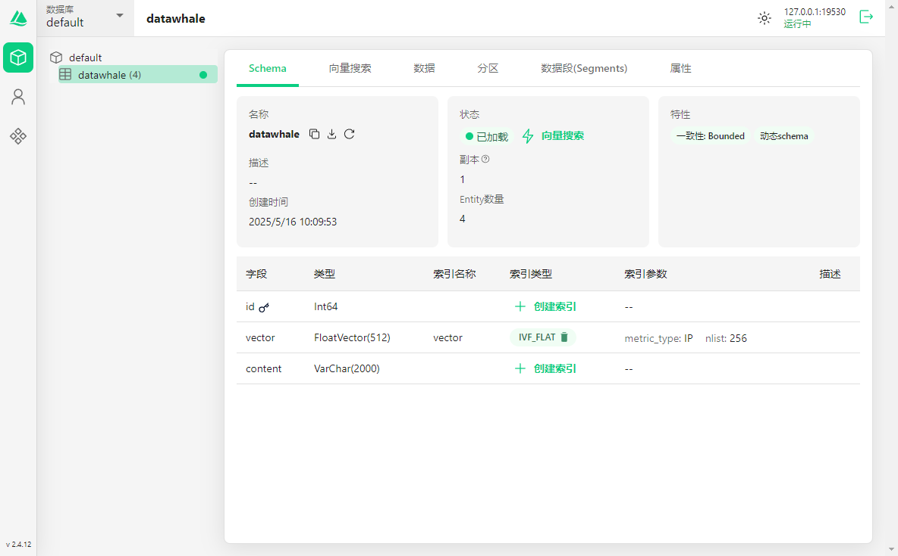

# milvus 文本嵌入实战

本节演示如何将文本向量化后再写入到milvus数据集中，并进行数据召回的实战。

# 1.嵌入模型下载

嵌入模型（Embedding Model）是一种将高维、离散的数据（如文本、图像、用户行为等）映射到低维连续向量空间的技术。其核心目标是通过低维向量捕捉数据的语义特征和关联性，使计算机能够高效处理和分析非结构化信息。例如，单词“猫”可以表示为向量 `[0.3, 0.8, -0.5]`，而“狗”可能对应 `[0.4, 0.75, -0.45]`，两者的向量距离较近，反映了语义的相似性。

**核心思想**
嵌入模型基于分布式表示原理，将数据点映射为实数向量，通过向量空间中的距离（如余弦相似度）量化语义关联。例如，Word2Vec通过预测上下文词生成词向量，而BERT则结合上下文动态调整向量表示

本节使用bge-small-zh-v1.5进行案例学习，模型的下载用的魔塔社区的平台

安装魔塔社区的python 第三方包

```
pip install modelscope
```

下载模型

```python
from modelscope import snapshot_download
model_dir = snapshot_download('BAAI/bge-small-zh-v1.5',local_dir="C:/Users/Administrator/Desktop/easy-vectordb/model/bge-small-zh-v1.5")
```

# 2.文本编码

利用模型对文本数据进行编码，在本节演示案例中，仅使用简单的句子分割进行演示，实际的生产案例中，需要对数据进行更加复杂的清洗。

```python
from sentence_transformers import SentenceTransformer

texts="""Datawhale已累计开发超过120门人工智能领域课程体系，其核心教材《Joy RL强化学习实践教程》凭借前沿的强化学习工程化实践内容，成功入选人民邮电出版社年度十大技术畅销书。在2025年度"AI春训营"项目中，Datawhale创新性地联合阿里云、商汤科技等12家科技领军企业，为11473名学员提供包含企业级项目实战、就业直通车等服务的全链路人才培养方案。Datawhale与上海交通大学安泰经济与管理学院共建的"AI+X"跨学科实训营，通过课程模块重构实现人工智能技术与经管专业课程100%融合，开创复合型人才培养新模式。Datawhale开源社区目前位列GitHub全球组织排行榜第64位，开发者网络已覆盖全球49个国家和地区。"""
#说明： 以上文本由AI模型生成，准确性不保证，仅供学习案例使用

# 文本预处理：按句号分割并过滤空句子
texts_list = [s for s in texts.split("。") if s.strip()]
for index,value in enumerate(texts_list):
    print(f"第{index}个句子-->{value}")
    
    
# 加载预训练的中文语义向量模型
model = SentenceTransformer('C:/Users/Administrator/Desktop/easy-vectordb/model/bge-small-zh-v1.5')
embeddings = model.encode(texts_list)

print(f"嵌入向量矩阵形状: {embeddings.shape}")

"""
第0个句子-->Datawhale已累计开发超过120门人工智能领域课程体系，其核心教材《Joy RL强化学习实践教程》凭借前沿的强化学习工程化实践内容，成功入选人民邮电出版社年度十大技术畅销书
第1个句子-->在2025年度"AI春训营"项目中，Datawhale创新性地联合阿里云、商汤科技等12家科技领军企业，为11473名学员提供包含企业级项目实战、就业直通车等服务的全链路人才培养方案
第2个句子-->Datawhale与上海交通大学安泰经济与管理学院共建的"AI+X"跨学科实训营，通过课程模块重构实现人工智能技术与经管专业课程100%融合，开创复合型人才培养新模式
第3个句子-->Datawhale开源社区目前位列GitHub全球组织排行榜第64位，开发者网络已覆盖全球49个国家和地区
嵌入向量矩阵形状: (4, 512)
"""
```

# 3.数据入库

向量生成后如何将数据写入到库中，

1.连接milvus环境

2.定义表的结构，在本节中，定义了3个字段 id、vector、content

3.批量写入数据

4.创建索引（非必须，根据个人的要求）

```python
# milvus环境连接
# alias: 数据库名称，可不填，默认为default
connections.connect(alias="default", uri="http://127.0.0.1:19530")

# 定义向量表结构
fields = [
    FieldSchema(name="id", dtype=DataType.INT64, is_primary=True),  # 主键字段
    FieldSchema(name="vector", dtype=DataType.FLOAT_VECTOR, dim=512),  # 512维浮点向量
    FieldSchema(name="content", dtype=DataType.VARCHAR, max_length=2000)  # 原始文本内容
]

# 创建集合（表）
schema = CollectionSchema(fields, enable_dynamic_field=True)
collection = Collection("datawhale", schema)

# 批量插入（含动态字段）
data = [
    [i for i in range(len(texts_list))], # 主键ID列表
    embeddings.tolist(), # 向量列表（转换为Python列表）
    texts_list # 原始文本列表
]

# 执行插入并刷新内存
collection.insert(data)
collection.flush()

# 创建混合索引
index_params = {
    "index_type": "IVF_FLAT",  # 倒排索引类型
    "metric_type": "IP",  # 内积相似度（适合归一化后的向量）
    "params": {"nlist": 256}  # 聚类中心数量
}
collection.create_index("vector", index_params)
collection.load()  # 将索引加载到内存
```

数据写入完成后，查看Attu，可以看到数据已经写入到库中了




# 4.数据检索

数据入库后需要对数据进行检索

## 4.1 向量检索

```python
connections.connect(alias="default", uri="http://127.0.0.1:19530")

model = SentenceTransformer('C:/Users/Administrator/Desktop/easy-vectordb/model/bge-small-zh-v1.5')
def vector_search(query_text: str, top_k=3):
    # 使用预训练模型对查询文本编码，生成向量（需与插入数据时的模型一致）
    # encode()返回二维列表[文本向量]，取第一个元素转为列表格式
    query_embedding = model.encode([query_text])[0].tolist()
    # 创建Collection对象，指定集合名称（需与插入数据时的集合名一致）
    collection = Collection("datawhale") 
    # 加载集合（若数据库中已存在该集合）
    collection.load()
    # metric_type指定距离度量方式，请确保索引中设置的距离度量方式与search_params中设置的一致
    search_params = {
        "metric_type": "IP"
    }
    
    # 执行向量搜索：
    # - data：查询向量列表（需为二维列表，此处包裹一层[]）
    # - anns_field：向量字段名（需与建表时定义的字段一致）
    # - param：搜索参数（如距离度量方式）
    # - limit：返回结果数量
    # - output_fields：指定返回的非向量字段（如"content"）
    results = collection.search(
        data=[query_embedding], 
        anns_field="vector", 
        param=search_params,
        limit=top_k,
        output_fields=["content"]
    )
    print(results)
    # 格式化输出结果
    print(f"\n向量查询结果：'{query_text}'")
    for idx, hit in enumerate(results[0]):
        distance = hit.distance  # IP转余弦相似度
        print(f"TOP {idx+1} | distance: {distance:.4f}")
        print(f"内容: {hit.entity.get('content')}\n" + "-"*60)
    return results

# 测试查询
vector_search("Datawhale的课程体系")


"""
data: [[{'id': 0, 'distance': 0.7300088405609131, 'entity': {'content': 'Datawhale已累计开发超过120门人工智能领域课程体系，其核心教材《Joy RL强化学习实践教程》凭借前沿的强化学习工程化实践内容，成功入选
人民邮电出版社年度十大技术畅销书'}}, {'id': 2, 'distance': 0.6843360662460327, 'entity': {'content': 'Datawhale与上海交通大学安泰经济与管理学院共建的"AI+X"跨学科实训营，通过课程模块重构实现人工智能技术
与经管专业课程100%融合，开创复合型人才培养新模式'}}, {'id': 1, 'distance': 0.5838302373886108, 'entity': {'content': '在2025年度"AI春训营"项目中，Datawhale创新性地联合阿里云、商汤科技等12家科技领军企业
，为11473名学员提供包含企业级项目实战、就业直通车等服务的全链路人才培养方案'}}]]

向量查询结果：'Datawhale的课程体系'
TOP 1 | distance: 0.7300
内容: Datawhale已累计开发超过120门人工智能领域课程体系，其核心教材《Joy RL强化学习实践教程》凭借前沿的强化学习工程化实践内容，成功入选人民邮电出版社年度十大技术畅销书
------------------------------------------------------------
TOP 2 | distance: 0.6843
内容: Datawhale与上海交通大学安泰经济与管理学院共建的"AI+X"跨学科实训营，通过课程模块重构实现人工智能技术与经管专业课程100%融合，开创复合型人才培养新模式
------------------------------------------------------------
TOP 3 | distance: 0.5838
内容: 在2025年度"AI春训营"项目中，Datawhale创新性地联合阿里云、商汤科技等12家科技领军企业，为11473名学员提供包含企业级项目实战、就业直通车等服务的全链路人才培养方案
------------------------------------------------------------
"""

```

向量检索，使用的方法是 `collection.search`，通过向量检索返回了相关的数据集

## 4.2 混合查询（向量+标量过滤）

milvus支撑向量+标量过滤混合检索

```python
connections.connect(alias="default", uri="http://127.0.0.1:19530")

model = SentenceTransformer('C:/Users/Administrator/Desktop/easy-vectordb/model/bge-small-zh-v1.5')
collection = Collection("datawhale") 
collection.load()
def hybrid_search(query_text: str, filter_expr=None, top_k=5):
    # 生成查询文本的向量表示（需与构建向量库时的模型一致）
    query_embedding = model.encode([query_text])[0].tolist()
    
    # 设置向量搜索的相似度度量方式
    search_params = {
        "metric_type": "IP"
    }
    
    # 执行混合搜索：同时利用向量相似度和标量条件过滤
    results = collection.search(
        data=[query_embedding],             # 查询向量
        anns_field="vector",                # 存储向量的字段名
        expr=filter_expr,                   # 标量过滤表达式（如"field_name > value"）
        param=search_params,                # 搜索参数
        limit=top_k,                        # 返回结果数量
        output_fields=["id", "content"]     # 需要返回的额外字段
    )
    
    # 格式化输出搜索结果
    print(f"\n混合查询：'{query_text}' | 过滤条件: {filter_expr}")
    for idx, hit in enumerate(results[0]):
        # 获取相似度得分（IP距离：值越大越相似）
        distance = hit.distance
        # 获取原始文本内容
        content = hit.entity.get('content')
        print(f"TOP {idx+1} | distance: {distance:.4f}")
        print(f"内容: {content}\n" + "-"*60)
    
    return results

# 测试场景
hybrid_search(
    query_text="Datawhale", 
    filter_expr='content like "%AI春训营%"'  # 标量过滤
)


"""
混合查询：'Datawhale' | 过滤条件: content like "%AI春训营%"
TOP 1 | distance: 0.5231
内容: 在2025年度"AI春训营"项目中，Datawhale创新性地联合阿里云、商汤科技等12家科技领军企业，为11473名学员提供包含企业级项目实战、就业直通车等服务的全链路人才培养方案
------------------------------------------------------------
"""
```

